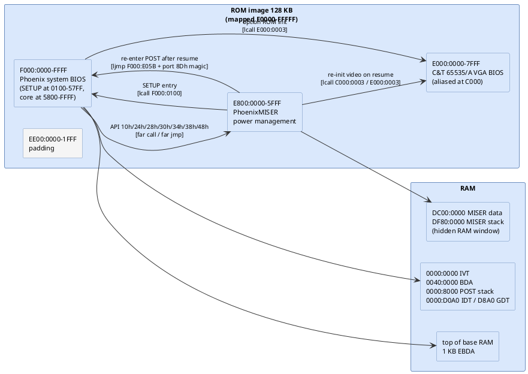
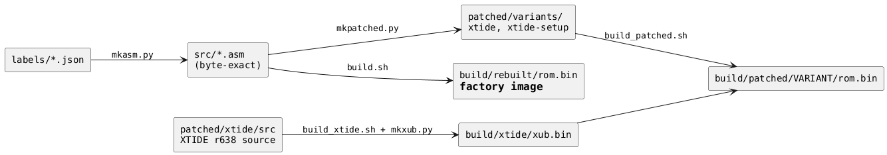
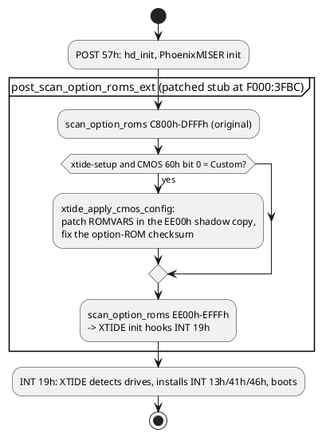
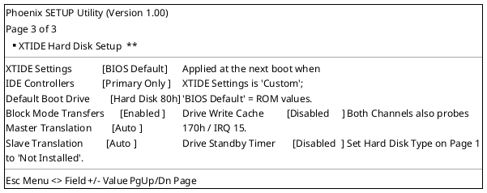
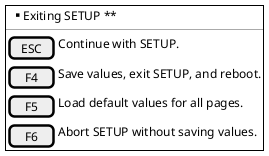

# Compuadd 486 "Color Scan 450" BIOS teardown

Reverse-engineering notes for the 128 KB ROM image `BIOS from Compuadd 486 Color Scan 450.BIN`
(SHA-256 `3c3764e5…7d00c4`). The image has no symbols; every name in these notes and in the
generated listings is a best guess derived from what the code does, and is marked as such in the
label files. Where a guess is weak the comment says "best guess".

| Document | Contents |
|---|---|
| [docs/01-system-bios-post.md](docs/01-system-bios-post.md) | Reset entry, the Phoenix ROM-stack idiom, the full POST sequence with flow charts, POST checkpoint codes, shutdown codes, beep codes, error messages, boot |
| [docs/02-system-bios-runtime.md](docs/02-system-bios-runtime.md) | Interrupt vector table, service dispatch tables (INT 10/13/14/15/16/17/1A, keyboard IRQ), data tables, BIOS data area and CMOS usage, I/O port map |
| [docs/03-phoenixmiser.md](docs/03-phoenixmiser.md) | PhoenixMISER PT68C268 power-management module: API entry table, APM handlers, POWER METER, suspend/resume state machine with flow chart, screens |
| [docs/04-vga-bios.md](docs/04-vga-bios.md) | Chips & Technologies 65535/A VGA BIOS: init, INT 10h dispatch, extended functions, fonts |
| [docs/05-setup-utility.md](docs/05-setup-utility.md) | Phoenix SETUP 1.00: hot keys (Ctrl+Alt+S/F3/F4/F8), screens reconstructed as Salt mock-ups, key handling, CMOS correction table |
| [docs/06-method-and-tools.md](docs/06-method-and-tools.md) | How the analysis was done, the tools in `tools/`, how to regenerate everything |
| [docs/07-hardware.md](docs/07-hardware.md) | Hardware inventory with I/O ports, IRQs, DMA, installed vectors and the DOS-side drivers each device needs, matched against the Compuadd 450 ColorScan and its dock |
| [docs/08-int13-hard-disk.md](docs/08-int13-hard-disk.md) | The IDE/INT 13h hard-disk driver end to end: installation, dispatch, CHS-to-task-file mapping, auto-detect via IDENTIFY, integrity checks, and a sketch of the planned LBA patch |
| [docs/09-references.md](docs/09-references.md) | External research: the Chaplet iLuFA 750 / "NBE" origin of the machine, PicoPower Evergreen chipset, firmware pedigree, located drivers and docs (kept in `drv/`), entering SETUP after boot |
| [docs/10-teardown-photos-2026-09-05.md](docs/10-teardown-photos-2026-09-05.md) | Owner's teardown photos: the RAM daughtercard (8x NEC DRAM), and the mainboard section with the 4 separate BIOS/PCMCIA ROM chips, the Cirrus Logic PCMCIA controller, and the ESS sound chipset |
| [docs/11-patched-rom.md](docs/11-patched-rom.md) | **Patched ROM variants**: XTIDE Universal BIOS in the 8 KB padding slot for LBA/EBIOS disk support (`xtide`), plus a third SETUP page for its settings (`xtide-setup`); build commands, the POST hook, the SETUP-engine changes, emulator verification, risks, licence |
| [disasm/](disasm/) | Function inventories (`*-functions.md`, in the repo) and the labelled listings (`*.asm`, generated locally from your dump, not in the repo) |
| [src/](src/) | **Re-assemblable NASM source** for the three modules (`tools/mkasm.py`, generated locally, not in the repo), verified byte-exact: `bash tools/build.sh` rebuilds the identical 128 KB image; `vars.inc` (RAM variable offsets) is tracked |
| [patched/](patched/) | **Patched ROM as assembly**: `variants/xtide/` and `variants/xtide-setup/` (`sys/miser/vga.asm` derived from `src/` by `tools/mkpatched.py`, generated locally) plus the XTIDE Universal BIOS r638 source (`xtide/src/`, GPL v2, local change in `xtide/CHANGES.txt`); `bash tools/build_patched.sh [variant]` builds `build/patched/<variant>/rom.bin` |
| [docs/generated/](docs/generated/) | Generated tables: I/O-port and CMOS usage, [chipset register cross-reference](docs/generated/chipset-registers.md), [decoded data tables](docs/generated/tables.md) (disk types, diskette parameters, SETUP records, VGA mode blocks), [PhoenixMISER text and screens](docs/generated/miser-text.md), [RAM variables and structures](docs/generated/variables.md) (BDA, IVT, MISER private RAM, SMRAM, SETUP frame and records, with the functions that touch each) |

## What is in this repository, and what is not

This is a free-software project (MIT, see `LICENSE`) about a proprietary ROM. The repository holds the
analysis, not the firmware:

- **included**: the disassembler and build tools (`tools/`), the label databases that carry every routine
  and variable name (`labels/`), the documentation of the firmware and of the hardware it drives (`docs/`),
  the XTIDE Universal BIOS source used by the patched variants (`patched/xtide/src`, GPL v2), the patch
  generator, and the emulator tests.
- **not included**: the ROM dump itself, the generated listings (`disasm/*.asm`), the byte-exact sources
  (`src/*.asm`) and the patched variant sources (`patched/variants/`). Each of those is the Phoenix and
  C&T firmware in another encoding, so they are regenerated locally from your own dump and ignored by git.
  Third-party datasheets and driver disks are downloaded into `drv/` by `tools/fetch_drv.sh` rather than
  redistributed; `docs/09-references.md` lists every source.

### Getting started with your own ROM dump

1. Dump the 128 KB BIOS ROM of a Compuadd 486 Color Scan 450 (or Chaplet iLuFA 750 / Halikan NBD 486 with
   the same Phoenix A486 1.03 + PhoenixMISER firmware) and save it in this folder as
   `BIOS from Compuadd 486 Color Scan 450.BIN`. The image the labels were made for has SHA-256
   `3c3764e589ae29e3e20700336847ff685e41152e26b3d19d77ec92212c7d00c4`; another revision will still
   disassemble, but labels will be off wherever the code differs.
2. In WSL (or any Linux with Python 3 and NASM): `bash tools/setup-wsl.sh`, put NASM 2.16.03 on the PATH or
   in `build/nasm/`, then follow *Regenerating*, *Rebuilding the ROM from source* and *Building the ROM
   variants* below. `bash tools/build.sh` must print `IDENTICAL`, which proves the labels, sources and
   tools agree with your dump before anything else is trusted.

### Hardware documentation

The teardown produced hardware notes that stand on their own, independent of the BIOS work:
[docs/07-hardware.md](docs/07-hardware.md) (resource map, PicoPower chipset registers as used by the
firmware, trackball interface, docking station, the CompactFlash card),
[docs/09-references.md](docs/09-references.md) (the Chaplet origin of the machine, firmware pedigree, where
every datasheet and driver was found) and
[docs/10-teardown-photos-2026-09-05.md](docs/10-teardown-photos-2026-09-05.md) (boards and chips as
photographed), plus the generated [chipset register cross-reference](docs/generated/chipset-registers.md)
and [I/O-port and CMOS maps](docs/generated/sys-ports-cmos.md).

## What is in the image

Four things share the one 128 KB ROM. The system BIOS is a Phoenix 80486 ROM BIOS PLUS; the
power-management module and the SETUP utility are also Phoenix; the video BIOS is from Chips and
Technologies. Strings give the pedigree:

| Component | Identifying strings | File offset | Size |
|---|---|---|---|
| C&T 65535/A VGA BIOS 2.0.0 | `IBM VGA Compatible BIOS.`, `Chips 65535/A VGA 32KB BIOS`, `Copyright (C) 1994 Chips and Technologies` | 0x00000 | 32 KB |
| PhoenixMISER PT68C268 | `PhoenixMISER`, `PhoenixMISER(TM) PT68C268`, `Copyright (c) 1991, 1992 Phoenix Technologies Ltd.` | 0x08000 | 24 KB |
| padding | zero-filled apart from 4 bytes at 0x0F16F | 0x0E000 | 8 KB |
| Phoenix SETUP 1.00 | `Phoenix SETUP Utility (Version 1.00)`, `(c) Phoenix Technologies Ltd. 1985, 1993` | 0x10000 | ~22 KB (part of the system BIOS segment) |
| Phoenix system BIOS | `PhoenixBIOS(TM) A486 Version 1.03`, `Copyright 1985-1992 Phoenix Technologies Ltd.`, OEM line `NBE BIOS For STN Panel.[94070501]` | 0x15800 | rest of the 64 KB segment |

The OEM line dates the build to 1994-07-05 and identifies the target as a notebook with an STN
colour panel. The MISER credits string names the OEM engineering team (team leader, motherboard,
power, sound and BIOS engineers). SETUP strings confirm the platform: `TrackBall`, `VersaPort`
(a shared parallel / external-floppy / EPP connector), `LCD Dim`, `System Suspend`, `Display
Device [CRT|LCD|LCD & CRT]`, and a `Power & Video Setup` page.

## Runtime memory map

The system BIOS far-calls the video ROM at `E000:0003` and the power module at `E800:xxxx`, and
the MISER module checks for a `55AA` header at both `C000:0000` and `E000:0000`. So the ROM is
mapped in one piece at `E0000-FFFFF`, with the chipset able to alias the video ROM at the
conventional `C0000`.



| Address | Owner | Notes |
|---|---|---|
| `F000:FFF0` | system BIOS | reset vector, `jmp F000:E05B`; date string `04/19/90` (Phoenix placeholder), model byte `FC` |
| `F000:E05B` | system BIOS | POST entry, jumps to `post_start` at `F000:58DA` |
| `F000:0100` | system BIOS | far-callable SETUP entry (used by MISER and the Ctrl+Alt+S hot key) |
| `F000:E401` | system BIOS | fixed-disk parameter table, 47 types × 16 bytes |
| `F000:FA6E` | system BIOS | 8×8 font for characters 00h-7Fh (INT 1Fh points at the VGA ROM's copy once the VGA ROM has run) |
| `E800:0010-004B` | MISER | far-callable API entry table (see [docs/03](docs/03-phoenixmiser.md)) |
| `E000:2C44` | VGA | INT 10h handler (also INT 6Dh) |
| `0000:0380` | RAM | temporary POST stack (`0030:0080`) before RAM is trusted |
| `0000:8000` | RAM | main POST stack once base memory passed |
| `0040:0000` | RAM | BIOS data area; the Phoenix code reaches it through DS=0 as `[04xx]` |
| `0040:0067` | RAM | reset-continuation far pointer used by the shutdown-code paths |
| `0000:7C00` | RAM | boot sector load address (far pointer constant at `F000:D4A1`) |

## Reading the listings

`disasm/sys.asm`, `disasm/miser.asm` and `disasm/vga.asm` are the labelled disassemblies. Each
line is `SEG:OFF  bytes  mnemonic operands ; notes`. Labels are:

| Prefix | Meaning |
|---|---|
| `sub_XXXX` | a routine reached by `call` (or by a table of near pointers) that has not been given a name yet |
| `loc_XXXX` | a jump target inside a routine; the label line says which routine it belongs to (`; in <routine>`) so a `loc_` is never an unnamed region, just a branch inside the named one above it |
| `ret_XXXX` | a return address stored in ROM for the Phoenix ROM-stack idiom (see [docs/01](docs/01-system-bios-post.md#the-rom-stack-idiom)) |
| `tbl_XXXX` | the ROM word that holds such a return address, or a dispatch table |
| anything else | a best-guess name from `labels/*.json`; the comment under the label says what the evidence was |

Coverage at the time of writing (code bytes decoded by recursive descent from the known entry
points; every remaining byte is classified as identified data or as padding - nothing is left
unexplained):

| Module | Code decoded | Identified data (tables, strings) | 00h/FFh fill | Not yet classified | Labels |
|---|---|---|---|---|---|
| system BIOS (64 KB) | 59.3 % | 20.3 % | 20.4 % | 0.0 % | 2537 |
| PhoenixMISER (24 KB) | 84.5 % | 11.0 % | 4.5 % | 0.0 % | 1270 |
| C&T VGA BIOS (32 KB) | 55.6 % | 42.0 % | 2.3 % | 0.0 % | 1132 |

Measured by `tools/coverage.py` against the current listings. "Not yet classified" is
mostly text that the listing already shows as `db 'strings'` but that has no explicit data
range (the SETUP screens at `F000:03F2-1530`, the POST/boot messages), plus code that is only
reached through pointers kept in RAM (MISER's per-device records and event handlers, the
VGA mode-parameter blocks).

## Rebuilding the ROM from source

`src/vga.asm`, `src/miser.asm` and `src/sys.asm` are NASM sources generated from the same label
database as the listings. They carry every label and comment, use labels for all branch targets,
`db` for data and `times` for fill, and assemble to the original bytes:

```
bash tools/build.sh        # needs nasm (PATH, $NASM, or build/nasm/*/nasm.exe); prints IDENTICAL when the rebuild matches
```

Memory operands are symbolic where the segment is proven, `mov word [0x400 + bda.reset_flag], 0x1234`,
`mov byte [bp + setup_frame.page], 1`, `[miser_ram.std_enabled]`, through `struc` offsets in `src/vars.inc`
generated from `labels/vars.json`; the listings show the same names in the comment column.

Instructions that NASM would encode differently from the original assembler (it always picks the
shortest form, and one of the two `reg,reg` encodings) are kept as `db` with the mnemonic in a
comment so the rebuild stays bit-exact: about 13 % of the system BIOS, 7 % of MISER and 17 % of
the VGA BIOS instructions. Everything else is editable assembly.

## Building the ROM variants

Three images can be built from this folder, all from assembly, all reproducible:

| Variant | Command | Output | What it is |
|---|---|---|---|
| original | `bash tools/build.sh` | `build/rebuilt/rom.bin` | byte-exact rebuild of the factory image from `src/*.asm`; prints `IDENTICAL` |
| `xtide` | `bash tools/build_patched.sh xtide` | `build/patched/xtide/rom.bin` | XTIDE Universal BIOS (LBA / INT 13h extensions) in the empty 8 KB slot, initialised by an extended option-ROM scan; 37 bytes changed outside the slot |
| `xtide-setup` | `bash tools/build_patched.sh xtide-setup` | `build/patched/xtide-setup/rom.bin` | the same plus a third Phoenix SETUP page for the XTIDE settings (CMOS 60h/61h, applied at POST) |
| both | `bash tools/build_patched.sh` | both | |

Options: `IDE_CONTROLLER_COUNT=2` (build XTIDE with both channels), `SKIP_GEN=1` (assemble the
`.asm` in `patched/variants/` without regenerating them), `NASM=`, `PY=`. Details, risks and the
SETUP page are in [docs/11-patched-rom.md](docs/11-patched-rom.md). None of the patched images has
run on the machine yet; flash a spare chip.



How the XTIDE ROM gets control during POST (both patched variants):



The SETUP page added by `xtide-setup`, as rendered by the real SETUP code under the emulator
(`tools/emu_setup.py`):



The exit menu (Esc) is unchanged; F4 saves and reboots, and the new values take effect on that boot:



## Regenerating

Everything under `disasm/` and `docs/generated/` is produced by the scripts in `tools/`; the
hand-written knowledge lives in `labels/*.json`. From WSL, in this folder:

```
bash tools/setup-wsl.sh     # once: venv with capstone
bash tools/run.sh           # split image, disassemble all three modules
bash tools/fetch_drv.sh     # optional: download reference docs and drivers into drv/ (git-ignored)
```

See [docs/06-method-and-tools.md](docs/06-method-and-tools.md) for the details of the tools and
the Phoenix idioms they know about.

## Licensing

- Tools, label databases, documentation and build scripts: MIT (`LICENSE`).
- XTIDE Universal BIOS (`patched/xtide/src`): GPL v2, with the one local change recorded in
  `patched/xtide/CHANGES.txt`. A patched ROM image you build contains that GPL code.
- Phoenix system BIOS, PhoenixMISER and the C&T VGA BIOS: not included; you supply your own dump for your
  own machine, and the generated listings and sources stay on your disk.
