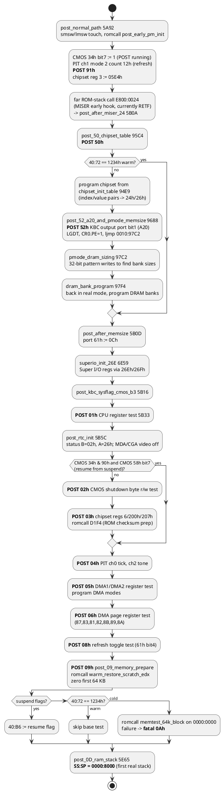
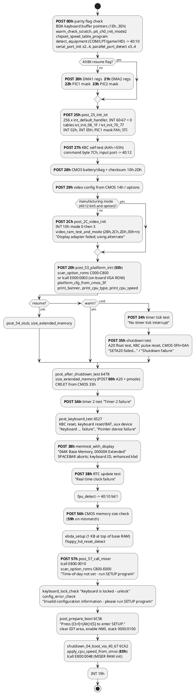
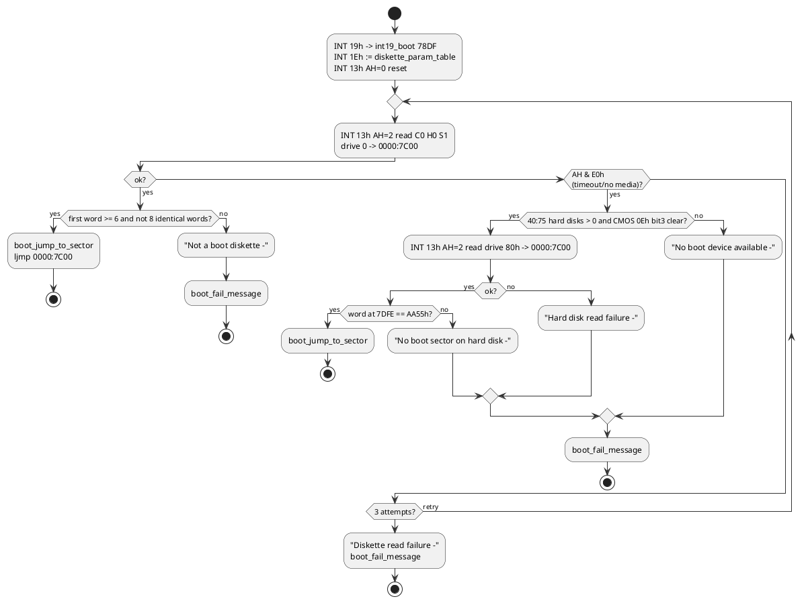

# System BIOS: reset, POST and boot

Module: Phoenix 80486 ROM BIOS PLUS, `A486 Version 1.03`, segment `F000`. Listing:
[`disasm/sys.asm`](../disasm/sys.asm). All addresses below are offsets in segment `F000` unless
written otherwise. Names are best guesses; the label file is
[`labels/sys.json`](../labels/sys.json).

## Entry

The CPU starts at `F000:FFF0` (`reset_vector`), which is `jmp F000:E05B`. `E05B` (`post_entry`)
is the classic IBM location and is nothing but `jmp post_start` (`58DA`). The area `E05E-E2C2`
is zero fill; the "IBM" compatibility marker sits at `E00E`, and the copyright string at `E020`.

Three things can land on `post_entry`:

| Source | How |
|---|---|
| power-on / hardware reset | reset vector |
| PhoenixMISER resume paths | `ljmp F000:E05B` from `E800:5429` and `E800:5502`, after writing a magic word to port `8Dh` |
| the shutdown-code paths inside the BIOS itself | `D3E9`, `D7C5` (NMI / unexpected-interrupt recovery) |

## The ROM-stack idiom

Until RAM has been tested there is no stack, so the Phoenix code cannot `call`. It uses two
tricks that the disassembler was taught to follow:

1. **ROM stack.** `SS` is loaded with `F000` (read from the segment word inside the reset vector,
   `cs:[FFF3]`) and `SP` is pointed at a word *inside the ROM* that contains the return address.
   The callee ends with a normal `ret`, which pops that word. Example from `post_start`:

   ```
   F000:58DA  mov  ss, cs:[FFF3]      ; SS = F000
   F000:58DF  mov  sp, 58E5           ; SP -> ROM word
   F000:58E2  jmp  post_stub_shl_edx  ; "call"
   F000:58E5  dw   58E7               ; tbl_58E5: the return address
   F000:58E7  ...                     ; ret_58E7: execution continues here
   ```

   The far variant is used to call into the MISER module: `mov sp, 5B06 ; ljmp E800:0024`, where
   `E800:0024` is a `retf` and `5B06` holds the dword `F000:5B0A`.

2. **Return through a register.** `mov di, 5D42 ; ... ; jmp di` (used once, in the DMA page
   register test).

Labels `ret_XXXX` mark such return points and `tbl_XXXX` the ROM words. A real stack appears at
POST code `0Dh`: `SS:SP = 0000:8000`. Before that a tiny stack at `0030:0080` (physical `0380`)
is used by the shutdown-code dispatcher, because the code that runs there can rely on RAM having
survived a soft reset.

## Cold start decision tree

```plantuml
@startuml
skinparam shadowing false
skinparam rectangleFontSize 11
skinparam rectangleBackgroundColor #dae8fc
skinparam rectangleBorderColor #6c8ebf
skinparam arrowColor #333333
skinparam arrowFontSize 10
skinparam actorBackgroundColor #fff2cc
skinparam actorBorderColor #d6b656
start
:reset_vector F000:FFF0
post_entry E05B -> post_start 58DA;
:SS=F000, ROM stack
romcall post_stub_shl_edx;
:read word from port 8Dh
(resume magic left by MISER);
if (magic == 1234h?) then (yes)
  :ljmp E800:0010
  MISER resume path A;
  stop
elseif (magic == 5678h?) then (yes)
  :chipset_cfg_200_update x2
  cmos_hd_type_check
  POST 22h;
  :ljmp E800:0010
  MISER resume path B;
  stop
else (no)
endif
:post_cold_entry 5945
cli, NMI off
chipset reg 1 via ports 24h/26h;
if (chipset reg1 bit 8 set?) then (yes)
  :DS=0040
  ljmp far [0040:0072]
  (resume vector left in BDA);
  stop
endif
if (KBC status bit2 = system flag\n(warm reset)?) then (yes)
  :AH = CMOS 0Fh shutdown code;
else (no)
  :AH = 0, clear 40:72 warm flag;
endif
:CMOS 0Fh := 0;
if (AH == 1?) then (yes)
  :post_after_memsize 5B0D;
  detach
endif
if (AH in 6..0Ah or 0Ch?) then (no)
  :init_pics_and_fpu 59B5
  FPU reset, PIC1/PIC2 ICWs;
endif
:post_shutdown_select 59EF
temp stack 0030:0080, DS=0;
if (4 <= AH <= 0Ch?) then (yes)
  :cache_apply_if_enabled (PM hook)
  jmp shutdown_dispatch[AH-4];
  detach
else (no)
  :post_normal_path 5A92;
  detach
endif
@enduml
```

### Shutdown codes (CMOS 0Fh)

`shutdown_dispatch` at `5A15` is indexed by *code − 4*. Codes 0-3 and anything above `0Ch`
take the normal path.

| Code | Target | Meaning (Phoenix / AT convention) |
|---|---|---|
| 00-03 | `post_normal_path` 5A92 | cold boot (0), after memory size (1, but intercepted earlier and sent to `post_after_memsize`), after memory test (2), after memory error (3) |
| 04 | `shutdown_04_boot_via_40_67` 6CA2 | INT 19h bootstrap request; this is also where the normal POST ends up before booting |
| 05 | `shutdown_05_jmp_40_67_eoi` 5A27 | flush KBC, send EOI to both PICs, then as 06 |
| 06, 0A | `shutdown_06_memtest_pass` 5A32 | restore CR0.ET from CMOS 33h bit 4, `ljmp far [0040:0067]` |
| 07 | `shutdown_07_memtest_fail` BEEE | protected-mode exit path with POST codes 01h/03h |
| 08 | `shutdown_08_memtest_pmode` 72B8 | return from the protected-mode memory sizer (`pmode_exit_via_reset`); checks port 80h for `90h` = unexpected interrupt |
| 09 | `shutdown_09_blockmove_return` 5A54 | return from INT 15h AH=87h block move: restore SS:SP from 40:67/69, disable A20, `retf 2` |
| 0B | `post_normal_path` 5A92 | (Phoenix extension) treated as cold |
| 0C | `shutdown_0C_phoenix_ext` 5A4B | restore SS:SP from 40:67/69 and `iret` |

## Early POST (no RAM stack)



Every fatal failure in this phase goes to `post_fatal_error` (`582E`): the code is written to port
80h, then depending on the ROM option byte `AF45` the machine halts, restarts POST, or beeps the
code (`beep_code_and_halt`, `5873`: a repeating pattern of PIT-channel-2 beeps derived from the
code, then `hlt`).

## Main POST (with a stack)



### Notes on individual phases

- **Chipset.** The chipset configuration space is a word index at port `24h` with a word data
  register at `26h` (`out 24h, ax` / `in ax, 26h`). Registers seen: 1 (resume status bit 8),
  3 (`05E4h`), 6 (`CFFFh`), `200h`, `207h`, `300h` (speed), plus the table at `94E9`. The MISER
  module names the companion chip `PT68C268`; the register style matches the Phoenix/PicoPower
  notebook chipsets of 1993-94 (best guess).
- **Super I/O.** `6E59` writes an index/data pair at `26Eh`/`26Fh` (index `01h` := `10h`,
  `03h` := `00h`), the usual configuration ports of a National/SMC Super I/O.
- **Memory sizing** is done in protected mode twice: once right after the chipset table
  (`pmode_dram_sizing`, 32-bit flat writes to size the banks and program the DRAM controller) and
  once after the shutdown test (`size_extended_memory`, GDT at `714C`, IDT built in RAM at
  `0000:D0A0`, every IDT entry pointing at `pmode_unexpected_int` which reports POST `90h`).
  Real mode is re-entered by resetting the CPU with CMOS `0Fh = 08h` (`pmode_exit_via_reset`),
  the classic 286 method kept for compatibility even on a 486.
- **Manufacturing mode.** Many tests are skipped when ROM option `AF45` bit 4 is set and the KBC
  input port (`40:12`) bit 5 is clear; that path also forces base memory to `100h` or `200h` KB.
- **Resume.** `40:B6` bit 0 is set when CMOS `34h` bits 7/4 and CMOS `58h` bit 7 indicate a
  suspend-to-disk / 0 V suspend; the keyboard and DMA tests are then abbreviated and the MISER
  module takes over through `E800:0010`.

## POST checkpoint codes (port 80h)

| Code | Where | Meaning |
|---|---|---|
| 00 | `a20_enable_and_enter_pmode`, `post_57_call_miser` | entering protected mode for memory sizing; last code before handing to MISER |
| 01 | `post_01_cpu_reg_test` | CPU register/segment test |
| 02 | `post_02_cmos_shutdown_byte_test` | CMOS shutdown byte r/w |
| 03 | `post_03_chipset_init` | chipset registers 6, 200h, 207h |
| 04 | `post_04_timer_init` | PIT channels 0 and 2 |
| 05 | `post_05_dma_test` | DMA controller registers |
| 06 | `post_06_dma_page_test` | DMA page registers |
| 08 | `post_08_refresh_test` | refresh toggle |
| 09 | `post_09_memory_prepare` | memory controller prep, first 64 KB |
| 0A | (fatal only) | first 64 KB failed |
| 0D | `post_0D_ram_stack` | stack established, parity |
| 20-23 | `post_20..23_*` | DMA1/DMA2 register tests, PIC1/PIC2 mask tests |
| 25 | `post_25_init_ivt` | interrupt vectors |
| 27 | `post_27_kbc_selftest` | keyboard controller |
| 28 | `post_28_cmos_checksum` | CMOS |
| 29 | `post_29_video_config` | video configuration |
| 2B, 2C, 2D | `video_ram_test_and_mode` | video RAM, mode set, vertical retrace |
| 2E | `post_2E_option_rom_c000` | video option ROM scan |
| 30-33 | end of `video_ram_test_and_mode` | 30h + adapter type from 40:10 |
| 34 | `post_34_timer_tick_test` | timer interrupt |
| 35 | `post_35_shutdown_test` | A20 / shutdown |
| 36 | `a20_enable_and_enter_pmode` (fatal) | Gate A20 failure in manufacturing mode |
| 37 | `shutdown_08_memtest_pmode` (fatal) | unexpected interrupt in protected mode |
| 38 | `post_38_memory_test` | memory test with display |
| 3A | `post_3A_timer2_test` | timer 2 |
| 3B | `post_3B_rtc_test` | real-time clock |
| 46, 47 | `setup_key_dispatch_loop` | SETUP utility running (44-47 appear in SETUP code) |
| 50 | `post_50_chipset_table` | chipset table |
| 52 | `post_52_a20_and_pmode_memsize` | A20 on, DRAM sizing |
| 53 | `post_53_platform_init` | platform init before option ROMs (best guess: shadow RAM / port 1FFh) |
| 54, 55 | `post_54_stub`, `post_55_cmos_33_check` | resume-path stubs |
| 56 | `post_56_cmos_memsize_check` | memory size vs CMOS |
| 57 | `post_57_stub`, `post_57_call_miser` | MISER hand-off |
| 59 | `post_56_cmos_memsize_check` | memory size mismatch |
| 90 | `pmode_unexpected_int`, MISER `miser_post_hook` | unexpected interrupt in protected mode; also MISER entry |
| 91 | `post_normal_path` | early chipset/refresh setup |
| B0-B3 | `cpu_speed_low_post_B0`, `cpu_speed_mid_post_B2`, `cpu_speed_high_post_B3` | CPU speed switching (`set_cpu_speed`) |
| E0 | `shutdown_04_boot_via_40_67` | about to boot |

## Messages

All POST messages are printed with `print_inline_msg` (the text follows the `call` in ROM and is
skipped on return) and most are followed by `set_post_error_flag`, which sets `40:72` bit 0 so
that `config_error_check` later prompts *Press the F1 key to continue* (F2 for SETUP when ROM
option `AF65` is non-zero).

| Message | Emitted by |
|---|---|
| `Display adapter failed; using alternate` | `post_2C_video_init` |
| `No timer tick interrupt` | `post_34_timer_tick_test` |
| `SETA20 failed to set FloatA20 high. Shutdown test skipped.` | `post_35_shutdown_test` |
| `Shutdown failure` | `post_35_shutdown_test` |
| `Timer 2 failure` | `post_3A_timer2_test` |
| `Keyboard controller failure` / `clock line failure` / `data line failure` / `stuck key failure` | `post_keyboard_test` (`post_keyboard_failure_msg` assembles them) |
| `Pointer device failure` | `post_keyboard_test` |
| `Real time clock failure` | `post_3B_rtc_test` |
| `Time-of-day not set - run SETUP program` | `post_57_option_rom_c800` |
| `Keyboard is locked - unlock` | `keyboard_lock_check` |
| `Invalid configuration information - please run SETUP program` | `config_error_check` |
| `BIOS ROM bad checksum = XXXXh` | `scan_option_roms` |
| `Gate A20 failure` | `a20_enable_and_enter_pmode` |
| `Unexpected interrupt in protected mode` | `shutdown_08_memtest_pmode` |
| `064K Base Memory, 00000K Extended`, `Beginning memory Test`, `Press the SPACEBAR to terminate the memory test.`, `Memory tests terminated by keystroke`, ` Decreasing available memory` | `memtest_with_display` |
| `Memory failure at SSSS:OOOO, read XXXX expecting YYYY` | `print_memory_failure` |
| `PhoenixBIOS(TM) A486 Version 1.03`, `<cpu> processor detected`, ` operating at NN MHz` | `print_banner`, `print_cpu_type`, `print_cpu_speed` |
| `Press [Ctrl]+[Alt]+[S] to enter SETUP.` | `post_prepare_boot` |
| `Diskette read failure -`, `Not a boot diskette -`, `No boot device available -`, `Hard disk read failure -`, `No boot sector on hard disk -` | `int19_boot` via `boot_fail_message` |
| ` press F1 to retry boot[, F2 for setup utility]` | `int18_boot_fail` |

CPU names available to `print_cpu_type` (table at `D94F`): `486 DX`, `486 SX`, `486 DX2`,
`486 DX4`, `386 DX`, `386 SX`, `386 SL`, `Cyrix 486 DX`, `Cyrix 486 SX`; speed text says
`over 100` or `under 16` outside the measured range.

## ROM option bytes

Phoenix builds carry a small block of configuration bytes that the code tests with `test
byte ptr cs:[...]`. In this image they live at `AF45-AF6B`:

| Offset | Meaning (from usage) |
|---|---|
| `AF45` bit0 | restart POST on fatal error instead of halting |
| `AF45` bit1 | halt on fatal error (no beep code) |
| `AF45` bit3 | 128 KB memory granularity handling (`2E0h`/`300h` KB special case) |
| `AF45` bit4 | manufacturing-mode tests keyed on KBC input port bit 5 |
| `AF45` bit5 | vector-numbering trick for `int_default_handler` |
| `AF46` bit0 | run `apply_cpu_speed_from_cmos` before boot |
| `AF46` bit1 | preset `40:15` to `0102h` |
| `AF46` bit2 | set a video mode from `40:10` before boot |
| `AF46` bit3, bit4, bit6, bit7 | LCD/CRT display handling gated on CMOS `1Fh` bits |
| `AF46` bit5 | suppress boot-failure message and prompt |
| `AF47` bit7 | alternate A20 method (`gate_a20_enable_alt`/`gate_a20_disable_alt`) and `gate_a20_kbc_path` on shutdown 9 |
| `AF55` | 25h: bit0 speed-change click, bits 2/5 misc |
| `AF56-AF58` | 48h/50h/50h: hot-key scancodes for the CPU speed keys (Up/Down with Ctrl+Alt) |
| `AF59` | 02h: CPU speed while the diskette controller is busy |
| `AF5D-AF5F` | 02h/01h/00h: the three CPU speed values for chipset register 300h |
| `AF65` | non-zero: offer F2 for SETUP in prompts |
| `AF66` | extra parallel port base |
| `AF68`, `AF6A` | extra serial port bases |

## Boot



`boot_fail_message` (`7977`) prints the message unless ROM option `AF46` bit 5 suppresses it,
waits for F1/F2 (`wait_f1_f2_key`; F2 enters SETUP), then issues `INT 18h`. `int18_boot_fail`
prints ` press F1 to retry boot, F2 for setup utility` and waits; on return `int19_boot` starts
over. The far pointer `0000:7C00` is a constant at `D4A1` (`bootsector_farptr`).
