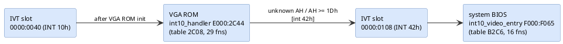

# System BIOS: runtime services and data

Module: Phoenix system BIOS, segment `F000`. Listing [`disasm/sys.asm`](../disasm/sys.asm),
function inventory [`disasm/sys-functions.md`](../disasm/sys-functions.md), generated port and
CMOS usage [`docs/generated/sys-ports-cmos.md`](generated/sys-ports-cmos.md).

## Interrupt vectors

`post_25_init_ivt` first points all 256 vectors at `int_default_handler` (`D56F`), zeroes
INT 60h-67h (user vectors), and then installs the two tables below plus INT 02h (`E2C3`) and
INT 05h (`FF54`). The classic IBM entry addresses are preserved as 3-byte `jmp` stubs so that
software which hard-codes them still works.

| INT | Stub (IBM address) | Handler body | Notes |
|---|---|---|---|
| 02 | `E2C3` | `int02_nmi_entry` → `D3xx` | NMI: prints `Memory parity` / `I/O card parity` / `Unexpected type 02` + `Type (S)hut off NMI` |
| 05 | `FF54` | print screen | |
| 08 | `FEA5` | `int08_timer_irq_entry` | timer tick |
| 09 | `E987` | `int09_kbd_irq_entry` | keyboard IRQ1, special keys via `kbd_special_dispatch` |
| 0A-0D | `FF33` | `int_default_irq_handler` | EOI both PICs, IRET |
| 0E | `EF57` | `int0E_floppy_irq_entry` | diskette IRQ6 |
| 0F | `FF43` | `int_default_irq_handler_2` | |
| 10 | `F065` | `int10_video_entry` → table `B2C6` | system fallback video (MDA/CGA); the VGA ROM re-vectors INT 10h to itself and saves this as INT 42h |
| 11 | `F84D` | equipment word `40:10` | |
| 12 | `F841` | base memory `40:13` | |
| 13 | `EC59` | `int13_disk_entry` | floppy table `A0C9`, hard disk table `7ED5` |
| 14 | `E739` | `int14_serial_entry` → table `887B` | |
| 15 | `F859` | `int15_handler` `BC63` | see below |
| 16 | `E82E` | `int16_handler` `8A53` → table `8A63` | |
| 17 | `EFD2` | `int17_printer_entry` → table `B24B` | |
| 18 | `7A36` | `int18_boot_fail` | " press F1 to retry boot" |
| 19 | `E6F2` | `int19_boot` `78DF` | |
| 1A | `FE6E` | `int1A_time_entry` → table `CF4B` | |
| 1B, 1C | `FF53` | `int_dummy_iret` | |
| 1D | `F0A4` | `video_param_table` | data, not code |
| 1E | `EFC7` | `diskette_param_table` | data |
| 1F | `0000` | (none) | the VGA ROM sets it to its 8×8 upper font |
| 41 | `E401` | `hd_param_table` | set when a hard disk type is configured |
| 70 | `D0CF` | `int70_rtc_irq` | RTC alarm / periodic |
| 71 | `D564` | `int71_irq9_redirect` | IRQ9 → INT 0Ah |
| 72, 73, 76 | `FF33` | default | |
| 74 | `C64D` | `int74_irq12_mouse` | PS/2 pointing device, feeds INT 15h C2h handler |
| 75 | `D553` | `int75_fpu_error` | clears port `F0h`, chains to INT 02h |
| 77 | `FF43` | default variant | |

## Service dispatch tables

Every service handler follows the same shape: `dispatch_clamp_ah` (`D236`) is called with
`DI = 2 × (number of functions)`; it sets `DI = AH × 2` when `AH` is in range, otherwise leaves
`DI` at the limit so that the *last* table entry is the "unsupported" handler. Then
`jmp cs:[di + table]`.

| Table | Service | Entries | Functions |
|---|---|---|---|
| `887B` `int14_dispatch` | INT 14h serial | 5 + default | 00 init, 01 send, 02 receive, 03 status, 04 extended init |
| `8A63` `int16_dispatch` | INT 16h keyboard | 18 + default | 00 read, 01 check, 02 shift status, 03 typematic, 04 click, 05 push key, 06-0F unsupported, 10 ext read, 11 ext check |
| `A0C9` `int13_floppy_dispatch` | INT 13h drives 00-7F | 25 | 00 reset, 01 status, 02/03/04 read/write/verify (shared), 05 format, 08 params, 15 type, 16 change line, 17 set type, 18 set media; rest unsupported |
| `7ED5` `int13_hd_dispatch` | INT 13h drives 80+ | 22 | 00 reset, 01 status, 02/03/04 r/w/verify, 05 format, 08/09 params/init, 0A/0B read/write long, 0C seek, 0D reset, 10/11 ready/recalibrate, 14 diagnostics, 15 type; rest unsupported |
| `B24B` `int17_dispatch` | INT 17h printer | 2 + default | 00 print char, 01 init, 02 status |
| `B2C6` `int10_sys_dispatch` | INT 10h (fallback) | 16 | 00-0F standard MDA/CGA functions |
| `BD84` `int15_80_91_dispatch` | INT 15h AH 80h-91h | 18 | 83 event wait, 84 joystick, 86 wait, 87 move block, 88 ext memory, 89 enter pmode, 90 device busy, 91 interrupt complete; 80/81/82/85 stubs |
| `C766` `int15_C2_mouse_dispatch` | INT 15h AH=C2h | 8 | 00 enable/disable, 01 reset, 02 sample rate, 03 resolution, 04 type, 05 init, 06 extended, 07 set handler |
| `CF4B` `int1A_dispatch` | INT 1Ah | 6 + default | 00/01 ticks, 02/03 RTC time, 04/05 date, 06/07 alarm handled in the default entry |
| `5A15` `shutdown_dispatch` | CMOS shutdown code | 9 | see [01](01-system-bios-post.md#shutdown-codes-cmos-0fh) |
| `8C88` `kbd_special_dispatch` | INT 09h special scancodes | 28 | parallel to `kbd_special_scancodes` (below) |
| `1CD6` `setup_cmos_correction_handlers` | SETUP | 8 | see [05](05-setup-utility.md) |

INT 15h functions outside the table are handled by a compare chain in `int15_handler` (`BC63`):

| AH | Handling |
|---|---|
| 87h | block move (`int15_87_move_block`, uses shutdown code 09h to return) |
| 53h | **APM** – far jump to PhoenixMISER `E800:0028` |
| BCh, 91h | checked but fall through |
| C0h | `int15_C0_get_sysconfig` → table at `E6F5`: length 8, model `FC`, submodel `01`, revision `00`, feature byte `74h` (2nd PIC, RTC, keyboard intercept, extended BIOS data area) |
| C1h | EBDA segment |
| C2h | pointing device, table `C766` |
| 4Fh | keyboard intercept (default returns CF=1) |
| 5Fh | platform video hooks, AL = 31h/33h/35h (CMOS display settings → chipset). The C&T VGA ROM's `AX=5F34h` is *not* handled here and returns unsupported |
| C9h | Phoenix: get CPU type; names at `cpu_name_table` (`D94F`) |
| 80h-91h | table `BD84` |

### Keyboard IRQ special keys

`int09_kbd_irq` scans the scancode against `kbd_special_scancodes` (`8C5C`, 28 bytes) and
jumps through `kbd_special_dispatch` (`8C88`). The first 16 entries have a parallel bit-mask
table `kbd_shift_flag_masks` (`8C78`) for the shift-state bytes `40:17`/`40:18`.

| Index | Scancode | Key |
|---|---|---|
| 0-7 | 1D 2A 36 38 54 3A 45 46 | Ctrl, LShift, RShift, Alt, SysReq, CapsLock, NumLock, ScrollLock make |
| 8-15 | 9D AA B6 B8 D4 BA C5 C6 | the same keys, break |
| 16, 17 | 52, D2 | Insert make / break |
| 18-20 | FF, FE, FA | overrun, resend, acknowledge |
| 21, 22 | E0, E1 | extended-key prefixes |
| 23-25 | AB, 41, 85 | platform-specific (best guess: Fn-key combinations of the notebook, e.g. the Ctrl+Alt+S hot key path) |
| 26 | 37 | PrtScr make |
| 27 | (none) | ordinary key → translation tables at `91B1` (normal), `9209` (shift), `9242`.. |

The handlers behind the table are named after their key: `kbd_ctrl_make/break`, `kbd_shift_make/break`,
`kbd_alt_make/break` (Alt break also emits the Alt+numpad character from `40:19`), `kbd_sysreq_make/break`
(INT 15h AH=85h), `kbd_capslock_make`, `kbd_numlock_make` (Ctrl+NumLock = Pause), `kbd_scrolllock_make`
(Ctrl+ScrollLock = Break, INT 1Bh), `kbd_lock_key_break`, `kbd_insert_make/break`, `kbd_overrun_FF`,
`kbd_resend_FE`, `kbd_ack_FA`, `kbd_prefix_E0/E1`, `kbd_prtscr_make` (INT 05h) and the two notebook
hooks `kbd_platform_key_AB` / `kbd_platform_key_41_85`.

## Runtime internals by subsystem

**Diskette driver (INT 13h, `9E46-AC2E`).** Commands go to the 82077-class controller through
`fdc_write_byte` (waits for RQM with DIO=0; a pending result phase is drained with
`fdc_read_result_bytes`) and `fdc_write_head_drive`; results come back through
`fdc_read_result_bytes_cx` into `40:42-48` and `fdc_read_2_results`; ST1 bits are mapped to
INT 13h status codes by `fdc_st1_error_codes` (`A21B`). `floppy_reset_controller` pulses the DOR
(`floppy_dor_reset_pulse`) and issues four sense-interrupts; `fdc_dumpreg_probe` (command `0Eh`)
tells an enhanced controller from an 8272 and sets `40:3F` bit 7. Seeks go through
`floppy_seek_if_needed` → `fdc_seek` (track cache `40:494+drive`) → `fdc_wait_seek_complete`
(IRQ 6 via `floppy_wait_irq`, sense interrupt, head settle from the parameter table);
`floppy_recalibrate` accepts the 80-step "equipment check" as track 0. The motor logic keeps the
count in `40:40` (`floppy_motor_count_set`, `floppy_motor_timeout_check`) and calls the
device-busy hook **INT 15h AX=90FDh** before spinning up (`floppy_motor_start_wait`) – that is
where PhoenixMISER learns about diskette activity. Media detection uses the disk-change line
(`floppy_disk_change_check`, DIR `3F7h` bit 7), a seek to track 4 plus recalibrate to clear it
(`floppy_disk_change_reset`, status `06h`), and a per-drive state byte `40:490+drive` that steps
through data-rate trials (`floppy_media_state_step`, table `A91D`); the data rate itself is set
by `floppy_select_data_rate` (CCR `3F7h`, shadowed in `40:8B`). The POST diskette test
(`post_floppy_seek_test`) is skipped when `40:B6` bit 0 (Quick Boot) is set.

**Keyboard controller helpers (`675E`, `7083-70A1`, `931D-9412`, `93BD-941C`, `C9E2-CAB5`).**
All KBC traffic waits with `kbc_wait_input_empty_timeout` / `kbc_wait_output_dx` (refresh-tick
timed); `kbd_send_byte_retry3` retries a keyboard command three times on `FEh`; the INT 15h C2h
pointing-device services use `kbc_send_aux_byte` (`D4h`) and `kbc_read_aux_byte` (waits for
`64h` bits 5+0). The INT 09h special-key path uses `kbd_shift_flags_set/clear` for the shift
state bytes and `kbd_e0_prefix_translate` for the E0-prefixed keypad keys. The keyboard buffer
tail is advanced by `kbd_buffer_advance` (wrap at `40:82`→`40:80`); SETUP uses
`kbd_buffer_push` / `kbd_buffer_flush`.

**CPU speed and its hot keys.** Three speed values live in the ROM options `AF5D/AF5E/AF5F`
(`02h/01h/00h`, written to chipset register `300h` by `set_cpu_speed`);
`cpu_speed_set_level` / `cpu_speed_get_level` translate between level 0-2 and those values, and
`40:B5` bit 2 remembers the alternate speed. The INT 09h handler reaches
`hotkey_cpu_speed_select` / `_toggle_pair` / `_toggle` for the scancodes in `AF56-AF58`
(`48h` Up, `50h` Down – reached only through the Ctrl+Alt special-key dispatch), with an audible
`speed_change_click` when `AF55` bit 0 is set. POST codes `B0h-B3h` come from
`cpu_speed_low/mid/high_post_*`; the diskette handler can switch to the byte `AF59` while the
FDC is busy.

**A20 and shadow RAM.** `gate_a20_enable` / `gate_a20_disable` use the KBC output port
(`gate_a20_kbc_path`) or, when ROM option `AF47` bit 7 is set, the fast variants
`gate_a20_enable_alt` / `gate_a20_disable_alt`; `a20_state_test` and `a20_wrap_test_dword`
detect the current state through the 1 MB wrap-around, and **INT 15h AH=24h**
(`int15_24_a20_gate_service`, AL=0/1/2/3) exposes it to software (HIMEM uses it).
`shadow_ram_setup` performs the shadow enable by copying the ROM to `1000:0000`
(`copy_rom_to_ram`) and jumping there (`shadow_enable_from_ram`), because chipset register
`200h` bit 12 switches the very ROM that is executing; `shadow_reg200_set_bits_from_ram` is the
generic form. `memory_present_test` (55AAh fill/verify) sizes RAM before the tests.

**Cache control.** `40:B5` bit 7 = cache on; `cache_enable` / `cache_disable` /
`cache_apply_if_enabled` route through small stubs (`C4BA-C4F0`, `WBINVD`) selected by the
flag bits returned from `cache_flags_from_4B5`.

**Fallback INT 10h (`B315-BC48`).** Until the video ROM has run, the system BIOS serves text and
CGA graphics modes itself: `scroll_text_body` / `scroll_fill_text` (with `int10_write_char_wait_retrace`
snow avoidance on CGA), `set_cursor_pos_store` / `cursor_to_crtc_value` / `crtc_write_pair`,
`teletype_control_chars`, `cga_pixel_address` / `cga_char_row_addr` for modes 4-6, and
`find_char_in_font` for read-character in graphics modes. `video_param_table` (`F0A4`, INT 1Dh)
supplies the CRTC values.

**Other services.** `cpu_type_lookup` (signature → `cpu_type_table` `D99C`) names the CPU for
INT 15h C9h and the banner; `printer_char_int17` / `printer_crlf_int17` drive INT 17h for the
boot-time messages; `wait_vsync_3xA` and `memory_test_click` / `speaker_click` are the small
timing/feedback helpers; `rtc_wait_uip_clear` / `rtc_reset_if_uip_stuck` guard every RTC access.

## Data tables

| Address | Name | Contents |
|---|---|---|
| `E401` | `hd_param_table` | 47 × 16 bytes: cylinders, heads, write-precomp, control byte, landing zone, sectors/track. Types 1-14 and 16-23 are the IBM standard set (10-62 MB), 25-43 add 34-127 MB drives (e.g. type 9: 900/15/17 = 112 MB, type 32: 1020/15/17 = 127 MB, type 33/34/37: 26 sectors per track). Types 15, 24, 44-47 are zero (15 is reserved; 44-47 are "Auto Detected", "AUTO 2", "User Defined", "USER 2" in SETUP). |
| `EFC7` | `diskette_param_table` | `DF 02 25 02 12 1B FF 54 F6 0F 08`: step rate 0Dh/unload, head load 1, motor-off 37 ticks, 512-byte sectors, 18 spt (1.44 MB), gap 1Bh, DTL FF, format gap 54h, fill F6, head settle 15 ms, motor start 1/8 s |
| `F0A4` | `video_param_table` | INT 1Dh table for the fallback INT 10h: CRTC register sets (first set `38 28 2D 0A 1F 06 19 1C 02 07 06 07` = 40-column text) |
| `FA6E` | `font_8x8` | 1 KB, characters 00h-7Fh |
| `E6F5` | `sysconfig_table_int15_C0` | `08 00 FC 01 00 74 00 00 00 00` |
| `E729` | (unnamed) | `17 04 00 03 80 01 C0 00 60 00 30 00 18 00 0C 00`: bit-mask table |
| `D49F` / `D4A3` | `zero_segment_word`, `zero_segment_word_2` | `0000` – loaded into DS to reach the IVT and BDA |
| `D4A1` | `bootsector_farptr` | `0000:7C00` |
| `D4A5` | `bda_segment_word` | `0040` |
| `D94F` | `cpu_name_table` | CPU names for INT 15h C9h and the banner |
| `94E9` | `chipset_init_table` | chipset register (index, value) pairs written by POST 50h |
| `AF45`-`AF6B` | `rom_option_flags` … | build options, see [01](01-system-bios-post.md#rom-option-bytes) |
| `6D24` | `port_probe_table` | `3F8 2F8 3E8 2E8` then `3BC 378 278 000` |
| `91B1`, `9209`, … | scancode → ASCII tables | `1234567890-=`, `qwertyuiop[]`, `asdfghjkl;'``, `\zxcvbnm,./`, shifted set, keypad `789-456+1230.`, Alt set |

## BIOS data area usage

The Phoenix code addresses the BDA with `DS = 0` and 16-bit offsets `04xx`. Fields touched by
the system BIOS (count of references in the listing in brackets):

| Offset | Field | Used for |
|---|---|---|
| 40:0E (5) | EBDA segment | set by `ebda_setup`; INT 15h C1h; pointing-device state lives in the EBDA |
| 40:10 (28) | equipment word | video type bits 4-5, FPU bit 1, mouse bit 2, floppy bits 0/6-7, COM/LPT counts |
| 40:12 (16) | KBC input port copy | bit 5 = manufacturing jumper, bit 4 = colour/mono, bit 6 = keyboard lock |
| 40:13 (11) | base memory KB | |
| 40:15 (6) | (Phoenix) | preset `0102h` by ROM option |
| 40:17-19 (27) | keyboard flags | shift states, Alt-numpad accumulator |
| 40:1A/1C (7) | keyboard buffer head/tail | initialised to `1Eh` |
| 40:3E-42 (56) | diskette recalibrate/motor/status | |
| 40:47 (3) | diskette controller status bytes | |
| 40:49-4E (56) | video mode, columns, page size, page offset | fallback INT 10h |
| 40:60-66 (19) | cursor type, page, CRTC base `40:63`, mode control | |
| 40:67/69 (18) | reset continuation SS:SP / far pointer | shutdown codes 05/06/09/0A/0C, `scan_option_roms` |
| 40:6C/6E (16) | tick count | `validate_rtc_time` seeds it from the RTC |
| 40:70/71 (5) | 24-hour rollover, Ctrl+Break flag | |
| 40:72 (16) | reset flag | `1234h` warm, `1235h` after shutdown-failure; bit 0 = POST error shown |
| 40:74-77 (7) | hard disk status/count/control/port | `40:75` drive count checked by `int19_boot` |
| 40:78-7F (4) | printer / serial timeouts | `1414h`, `0101h` presets |
| 40:80/82 (2) | keyboard buffer start/end | `1Eh`/`3Eh` |
| 40:8B-91 (11) | diskette media state | `floppy_detect_drives` |
| (all) | see [generated/variables.md](generated/variables.md#bda-00400-00500) for every BDA byte with its accessors | |
| 40:96/97 (24) | keyboard status flags 3/4, LED state | enhanced keyboard detection, `kbd_update_leds` |
| 40:98-A0 (19) | INT 15h wait-event pointer, wait flag, wait count | `int15_83_event_wait`, `int15_86_wait`, `int70_rtc_irq` |
| 40:B5 (21) | Phoenix POST/SETUP state | bit 0 SETUP active, bit 2 speed, bits 3/4/7 cleared by `post_early_pm_init` |
| 40:B6 (7) | Phoenix resume flag | bit 0 = resuming from suspend |
| 40:BC (3) | Phoenix POST scratch | preserved across the warm reset used to exit protected mode |
| 40:C0, 40:D0 (2) | | |

## CMOS map

Standard MC146818 fields `00h-0Fh` and IBM fields `10h-33h` are used with their usual meaning.
Phoenix-specific bytes seen in this build:

| Index | Use |
|---|---|
| 1Fh | option bits gating LCD/CRT handling (`post_29_video_config`, `keyboard_lock_check`, `boot_fail_message` tests bits 0, 1, 2) |
| 33h | bit 4 recorded from CR0 bit 0 / used for CR0.ET; low 3 bits compared with `cmos_33_expected` |
| 34h | bits 0-1 CPU speed selection, bit 5 "call MISER on POST 57h", bit 7 POST-in-progress, bits 4/7 with 58h bit 7 = resume from suspend |
| 3Fh | platform configuration byte copied to I/O port `1FFh` |
| 4Bh | written by the INT 1Ah RTC functions (extended century/alarm scratch) |
| 58h | bit 7 suspend-to-disk state |
| 59h | bit 5 pointing device present |
| 5Eh | read by `cga_pixel_address` (C&T extension register 3D6h/3D7h) and `post_display_device_select` |

The generated table [`docs/generated/sys-ports-cmos.md`](generated/sys-ports-cmos.md) lists
every CMOS index with the routines that read or write it.

## I/O ports

Beyond the standard AT set (DMA, PIC, PIT, KBC, RTC, port B), the platform-specific ports are:

| Port | Use |
|---|---|
| `24h` / `26h` | chipset configuration index / data (16-bit); ~50 accesses; the same pair is used by the MISER module |
| `8Dh` | word read at reset: `1234h` / `5678h` resume magic written by MISER |
| `8Fh` | written `0` before refresh timer programming (DMA page register for refresh channel) |
| `80h` | POST code |
| `EDh` | dummy write used everywhere as an I/O delay |
| `1FFh` | platform configuration byte from CMOS 3Fh |
| `26Eh` / `26Fh` | Super I/O configuration index / data |
| `201h` | game port |
| `3D6h` / `3D7h` | C&T 655xx extension registers (`cga_pixel_address`) |
| `388h` | written by `fm_synth_all_notes_off` (best guess: sound chip / AdLib address port, the MISER credits mention a sound engineer) |
