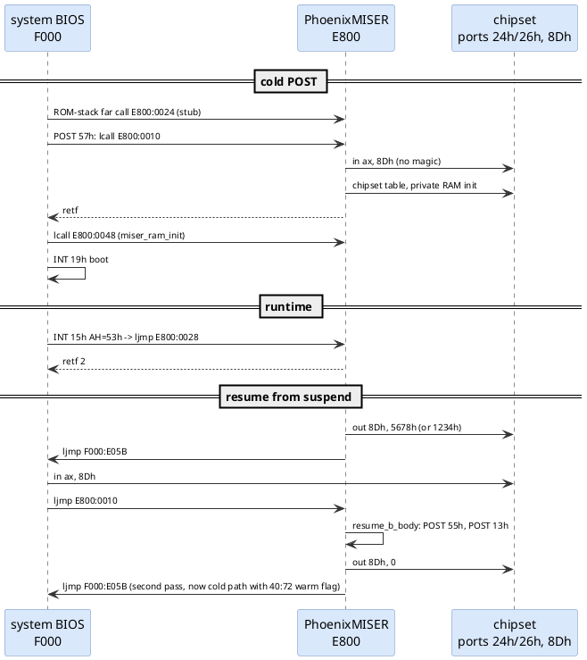
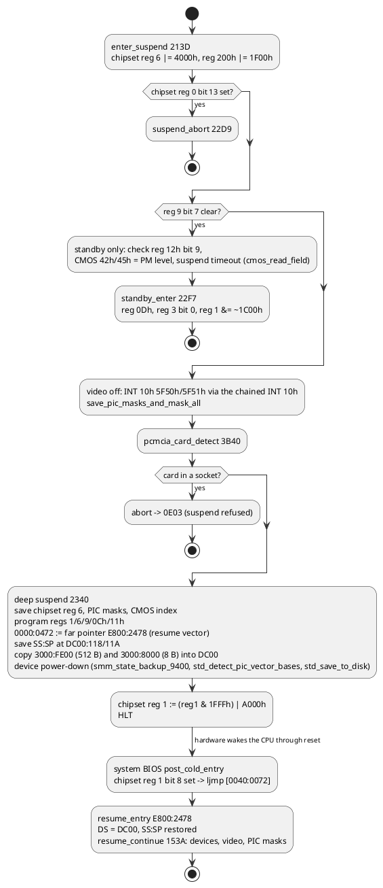
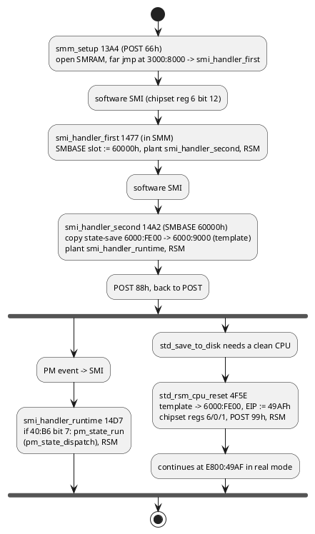
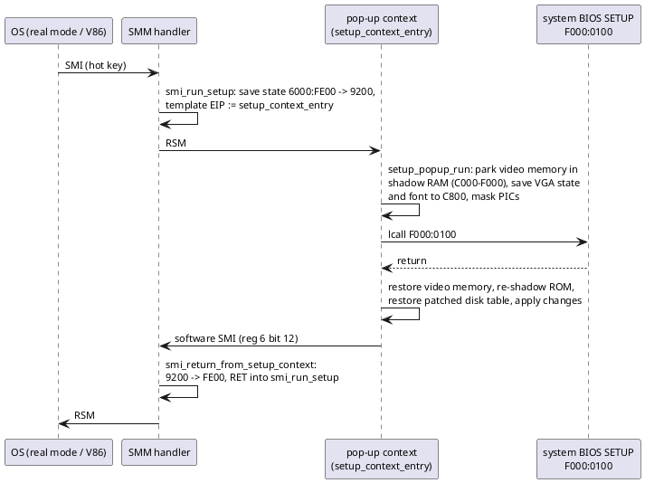
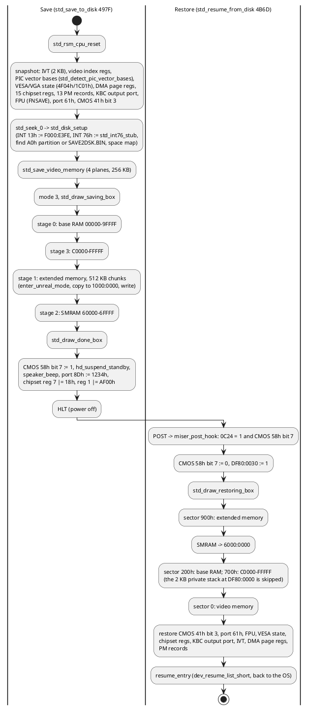
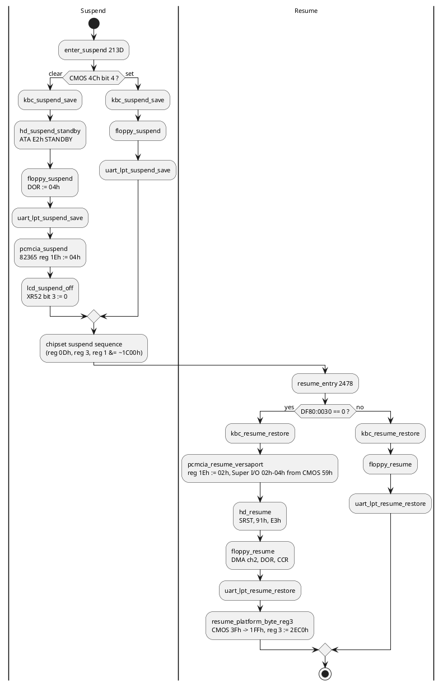
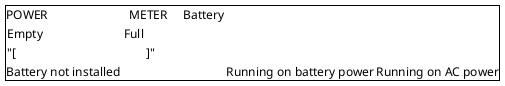
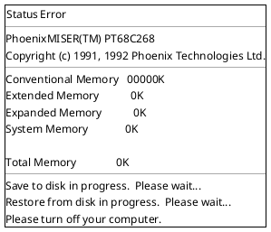

# PhoenixMISER power-management module

Module: `PhoenixMISER(TM) PT68C268`, `Copyright (c) 1991, 1992 Phoenix Technologies Ltd.`,
24 KB option-ROM image at file offset `0x8000`, executing at segment `E800`. Listing
[`disasm/miser.asm`](../disasm/miser.asm), labels [`labels/miser.json`](../labels/miser.json),
ports/CMOS [`docs/generated/miser-ports-cmos.md`](generated/miser-ports-cmos.md).

MISER is Phoenix's 1991-93 notebook power-management product; the `PT68C268` (very probably the
PicoPower/Phoenix PT86C268 "Redwood" 486 notebook chipset, the string may carry a typo) is the
companion chipset it drives. It implements APM 1.x for the OS, suspend/resume, save-to-disk
(with the `PHDISK` partition utility) and an on-screen battery meter.

## Layout

| Offset | Content |
|---|---|
| `0000` | `55 AA 30` option ROM header (24 KB) |
| `0003` | `retf` – the option-ROM init entry does nothing; the module is driven through its API instead |
| `0004` | `PhoenixMISER` signature |
| `0010-004B` | API entry table (below) |
| `0050` | credits: `** Team Leader:Albert Chen|MB:Alex Lin/Kevin Huang/Mark Ku|Power:K. L. Wu|Sound:Yen Yong Hwang|BIOS:Atlas Huang **` |
| `00DA` | `apm_function_table` |
| `10EB-1290` | POWER METER screen text |
| `2CC9` | `KeyboardPMSR` (keyboard power-management state record name, best guess) |
| `416D-45DE` | save-to-disk status/error screen text |
| `5FFF` | checksum byte (module does **not** sum to zero on its own; the checksum covers a larger range) |

**Byte budget.** All 24 576 bytes are accounted for: 20 769 bytes of code (every routine named), 3 778 bytes of identified data (tables, string records, screen rows, alignment pads) and 29 bytes of 00h fill; the 983-byte zero tail at `5C29-5FFF` is padding. See [docs/generated/miser-text.md](generated/miser-text.md) for the text and [disasm/miser-functions.md](../disasm/miser-functions.md) for the routine-by-routine inventory.

## API entry table

The system BIOS never scans this module as an option ROM; it calls fixed offsets. Each entry is
`call near ; retf` (or a `jmp`).

| Entry | Target | Name | What it does | Called from |
|---|---|---|---|---|
| `E800:0010` | `1624` | `miser_post_hook` | POST 90h; reads port `8Dh`: `1234h` → `resume_a_body`, `5678h` → `resume_b_body`, else full PM init: chipset table (`run_triple_table`), open private RAM, fill `DC00:0000-3FFF` with `1111h`, build the CMOS → PM `config_records` (`config_records_init`), run `dev_init_list` (`call_list_sum` over `04FE`), IRQ setup, write `34h` to `DC00:008D` | system BIOS `post_57_call_miser` (`lcall`), `post_start` (`ljmp` on both magic paths), `resume_b_body` |
| `E800:001C` | `1951` | `get_api_far_ptr` | returns `DX:AX = E800:002C` | (external) |
| `E800:0024` | – | `retf` | placeholder early-POST hook | system BIOS `post_normal_path` (ROM-stack far call) |
| `E800:0028` | `00CE` | `apm_int15_53_handler` | INT 15h AH=53h; `DS=DC00`, `apm_dispatch`, `retf 2` | system BIOS `int15_handler` |
| `E800:002C` | `18D7` | `pm_record_service` | AH & 0Fh selects one of 5 record accessors (`18CD`) on the per-device records in `DC00:008E+` | via `get_api_far_ptr` |
| `E800:0030` | `0EAA` | `show_power_meter` | draws the POWER METER overlay: saves the top 800 bytes of text page 0 to `C800:0000`, prints the box (INT 10h 13h, attribute 71h), reads the battery gauge from **port 1FFh bits 1-5** (0-31), status line from chipset reg 12h bit 0 (battery installed) and reg 1 bit 3 (AC present), shows the bar, waits, restores the screen | system BIOS `hotkey_power_meter` (Ctrl+Alt+F8 / Fn code 6Ah, `F000:CC0D`) |
| `E800:0034` | `057A` | `os_environment_check` | INT 2Fh AX=1600h (Windows enhanced mode?), INT 15h AX=1022h probe, then selects hot-key / save-to-disk behaviour | system BIOS `wait_key_f1_f2` (`7B3D`, with SS:SP reset to `0000:FFFE`), `86BD`, `CB57` |
| `E800:0038` | `0A69` | `miser_presence_signature` | `AX = DF00h` (also the private RAM segment) | system BIOS `miser_present_check` before every hot-key action |
| `E800:0040` | `1792` | `query_state_34` | `ZF = (DC00:008D == 34h)` (PM initialised?) | (external) |
| `E800:0048` | `17A4` | `miser_ram_init` | writes `AA55h, 20h` at `DC00:0000` then `close_private_ram` | system BIOS `shutdown_04_boot_via_40_67` just before `INT 19h` |

The module also calls **into** the system BIOS: `lcall F000:0100` (SETUP entry, from
`call_system_setup` at `061D`, i.e. the Ctrl+Alt+S / hot-key path), `ljmp F000:E05B` (restart
POST after resume, `restart_post_resume_a/b`), and `lcall C000:0003` / `lcall E000:0003`
(re-initialise the video ROM after resume, whichever address has a `55AA` header).

## Private RAM

The complete offset map with the functions touching each variable is generated in
[generated/variables.md](generated/variables.md#miser_ram-dc000-df800); the listings name these
locations `miser_ram.<name>`.

`open_private_ram` (`134A`) sets bit 7 of chipset registers `200h` and `207h`
(`chipset_reg_set_bits`) and `close_private_ram` clears it in `207h`. While open, the module uses:

| Segment | Use |
|---|---|
| `DC00:0000` | signature `AA55`, `20h`; state byte at `008D` (`34h` when initialised); per-device records from `008E` (8 bytes each, indexed by AL in `pm_subfn_dispatch`); flags at `0110`/`0112`; saved caller `SS:SP` at `1425/1427`; word `1492` (state bits); 16 KB fill of `1111h` at init |
| `DC00:0106-010F` | activity counters `0106-010A`, chipset reg `0Dh` timeout fields `010B-010E` (System Sleep, Suspend, LCD Dim) and the PM level `010F`, all copied from CMOS by `config_records` |
| `DC00:0494-04AF` | PM state flags, saved PIC masks (`0495/0496`), floppy present (`0497`), floppy DOR/CCR shadows (`04A8/04AA`), hard-disk count / idle count / FDPT sectors / heads (`04AC-04AF`) |
| `DC00:04B0` | `KeyboardPMSR` (module name string) |
| `DC00:04C0-057E` | keyboard-controller save area (flags `04C0-04C5`, output port `04C7`, command byte `04C8`, RAM bytes `04C9-04D8`, mouse status `04DC-04DE`, password `04DF-04E7`, RAM registers `04E8-04FE`, extended RAM 80h-FFh `04FF-057E`) |
| `DC00:057F-0589` | six progress-trace words written bit by bit during the keyboard save/restore (`kbc_suspend_save`, `kbc_resume_restore`) |
| `DC00:058E` | saved INT 6Dh vector = the video BIOS's INT 10h entry (`chain_prev_vector_058E` calls it directly) |
| `DC00:05C2-05F5` | COM base addresses `05C2-05C9`, UART LCR/IER/divisor/MCR copies `05CA-05D9`, LPT bases `05EA-05EF`, LPT control copies `05F0-05F5` |
| `DC00:05F7-0602` | RTC alarm: armed flag `05F7`, day-rollover `05F8`, tick count `05F9/05FB`, date snapshot `05FD/05FF/0601` |
| `DC00:0C24` | copy of CMOS `4Ch` bit 4 (`cfg_set_0C24`) |
| `DF80:07FF` | private stack used by `pm_services_body` |
| `DF00` | segment returned by `get_miser_ram_segment` |

The system BIOS is aware of the window only indirectly: the first thing `post_start` does is
read port `8Dh`, and `resume_a_body` restores the DMA page registers from `dma_page_restore_table`
(`5520`) because a 0 V suspend loses them.

## APM

`INT 15h AH=53h` arrives via the system BIOS at `apm_int15_53_handler`. `apm_dispatch` (`00F2`)
rejects `AL > 0Bh`, brackets the call with chipset register `0Eh := 3E18h` / `3E10h`, opens the
private RAM window and calls `apm_function_table[AL]`:

| AL | Handler | APM 1.1 function |
|---|---|---|
| 00 | `apm_00_installation_check` (`015A`) | installation check (returns version/flags; `BX` must be `0000h`) |
| 01 | `apm_01_connect_real_mode` | connect real mode |
| 02 | `apm_02_connect_16bit_pm` | connect 16-bit protected mode |
| 03 | `apm_03_connect_32bit_pm` | connect 32-bit protected mode |
| 04 | `apm_04_disconnect` | disconnect |
| 05 | `apm_05_cpu_idle` | CPU idle |
| 06 | `apm_06_cpu_busy` | CPU busy |
| 07 | `apm_07_set_power_state` | BX must be 1; only CX = 2 (suspend) is implemented: POST codes 71h/72h, `enter_suspend` (`213D`), then 70h. Standby (CX = 1) returns an error |
| 08 | `apm_08_enable_disable_pm` | enable / disable power management (flag word `DC00:000C` bit 7) |
| 09 | `apm_09_restore_defaults` | restore defaults |
| 0A | `apm_0A_get_power_status` | BH = AC line from chipset reg 1 bit 3; BL = battery status (FFh when reg 12h bit 0 says no battery, 2 = low from reg 0 bits 12-13, 1 = low when ≤ 25 %, else 0); CL = battery life % = `((port 1FFh & 3Fh) × 80) / 51` |
| 0B | `apm_0B_get_pm_event` | event bits in `DC00:000C`: 1 standby request, 2 suspend request, 3 normal resume, 4 critical resume, 5 battery low (set after three consecutive low readings of chipset reg 0 bits 12-13 / reg 9 bit 8, counter at `DC00:000E`); AH = 80h when none |

Errors follow the APM spec: 03h not connected (`0489`), 09h invalid device (`04A5`), 0Ah/0Bh
disabled (`0491`), 60h bad parameter (`04A9`), 80h no event (`04B1`).

## Resume and POST re-entry

The two magic values select two resume flavours in `miser_post_hook`: `1234h` → `resume_a_body`
(chipset register 1 |= 7, POST `EEh`, DMA page registers restored, full restore from the saved
state), `5678h` → `resume_b_body` (POST `55h`, re-run the init hook, POST `13h`, then clear the
magic and restart POST). On the system side `post_start` also accepts both values and hands
control to `E800:0010` immediately, before any hardware test, so a resume never runs the memory
tests.

## Activity hooks and the save-to-disk partition

`install_activity_hooks` (`07A6`) replaces six interrupt vectors with MISER handlers whose far
pointers live in the private RAM at `DC00:0028-003F`, keeping the originals at `DC00:0020/24` and
in the `0058E`-style slots used by `chain_prev_vector_058E`:

| Vector | Purpose of the hook |
|---|---|
| INT 09h | keyboard activity resets the LCD-dim / system-sleep timers |
| INT 10h | video calls keep the panel awake |
| INT 15h | APM (AH=53h) and device-busy notifications (AH=90h/91h) |
| INT 16h | keyboard-service polling |
| INT 21h | DOS calls (idle detection: the DOS idle call lets MISER slow the CPU) |
| INT 33h | mouse driver traffic (trackball activity) |

`restore_original_vectors` (`0761`) undoes INT 21h/33h/10h. IRQ15 (INT 77h) is also pointed at
the module during init (`171B`).

Save-to-disk (`std_find_partition`, `5684`): reset the controller, read the MBR of drive 80h,
require the `AA55h` signature, find a partition of **type A0h** (the PhoenixMISER/PHDISK type),
record its start LBA and size, take heads and sectors-per-track from the INT 41h parameter table,
and read/validate the "good space map" at the start of the partition. Reads use INT 13h AH=02h
with `lba_to_chs_int13`, so **the partition code depends on the same CHS geometry the BIOS
reports** – an LBA patch must keep the INT 41h table consistent with what INT 13h addresses.
Error codes 1-9 select the messages in the status box (`std_report_error`).

## Suspend and resume in detail

`enter_suspend` (`213D`) is reached from APM set-power-state (CX = 2) and from the internal
time-out logic. What it does, in order:

The two-stage design explains the strings and the PCMCIA check: a card left in a socket blocks
suspend (the 82365 would lose its configuration), the panel is turned off through the C&T 5F51h
call, and the resume path re-enters the system BIOS at its reset vector with chipset register 1
flagging a resume, so POST is short-circuited into the MISER code before any memory test runs.
The **save-to-disk** flavour is described in its own section below: `enter_suspend` calls
`std_save_to_disk` when `DC00:0C24` says the feature is on, and `miser_post_hook` calls
`std_resume_from_disk` on the next power-up.

## System Management Mode

The PT86C268 has SMM support and MISER uses it for the power-management events. `smm_setup`
(`13A4`, POST `66h`, run from `dev_init_list`) opens the SMRAM window through chipset registers
`1`/`2` (bits `103h`), plants a far jump at the SMI entry `3000:8000` (SMBASE `30000h` + `8000h`;
the same RAM is also visible at `6000:8000`) and fires two software SMIs with reg `6` bit 12:

The state-save template (`6000:9000`, 512 bytes copied from the CPU's own SMM dump) is the key
trick: `std_rsm_cpu_reset` writes it back to `6000:FE00` with the EIP slot pointed at the
instruction after its own call and executes `RSM`, which drops the CPU into a known real-mode
state whatever the OS had set up (the same idea as the Phoenix `mov ss/sp` re-entry after a
keyboard-controller reset, but without losing memory). `smi_handler_runtime` is where the
suspend/standby state machine really runs: `pm_state_run` (`2828`) indexes `pm_state_dispatch`
(`2808`) with the event number from chipset reg `1` bits 4-7 (mask `F0h`, acknowledged by writing `0Fh` back), so the entries `1B07`, `1B99`, `1C2F`,
`1E34`… are SMI-time handlers (LCD dim, system sleep, suspend request, resume). `40:B6` bit 7 is
the master enable the system BIOS and SETUP toggle.

### Pop-up SETUP from the SMI, and the Fn hot keys

The runtime handler dispatches on the event code the chipset reports in register `1` bits 4-7
(`pm_state_run` → `pm_state_dispatch`):

| Code | Handler | What happens |
|---|---|---|
| 1, 3, 0Bh | `pm_enter_suspend_state` | `enter_suspend`, chipset reg 1 := `20F7h`, beep |
| 2 | `pm_evt_ack_only` | reg 1 \|= `F7h` |
| 4 | `pm_evt_standby_or_suspend_timeout` | first stage standby (disk `E2h`, reg 1 := `77F7h`, `0110` := 2), second stage suspend; refused while a PCMCIA card is inserted (`pm_card_present_toggle`) |
| 5 | `pm_evt_activity_wakeup` | back to full speed after sleep, re-arm the disk timer |
| 6 | `pm_evt_lcd_dim` | LCD Dim timeout: CMOS `3Fh` with contrast bits cleared → port `1FFh` |
| 7 | `pm_evt_fn_hotkey` | Fn key: chipset reg 7 bits 8-10 = 1 brightness up, 5 brightness down, 6 contrast up, 2 contrast down (CMOS `3Fh` bits 3-7 / 0-2 → port `1FFh`), 7 volume up / 3 volume down on the Sound Blaster DSP (`DEh` read, `DFh` set) |
| 8 | `pm_evt_system_sleep` | System Sleep timeout: clock slowed (reg 1 := `20F7h`), panel off |
| 0Ch | `pm_evt_reinit_timeouts` | after a SETUP change: `pm_timeouts_apply`, counters reset |
| 0Eh | `pm_evt_resume_irqs` | `pm_irq_reenable`, reg 1 := `FFF7h` |
| 0, 9, 0Ah, 0Dh, 0Fh | `pm_state_default` | reg 6 \|= `4000h`, reg 1 \|= `F7h` |

So the brightness, contrast and volume keys are not keyboard scancodes at all: the keyboard
controller signals them to the chipset, the chipset raises an SMI, and MISER changes the panel
byte (port `1FFh`, mirrored in CMOS `3Fh`) or the codec volume. The Ctrl+Alt hot keys documented
in [05](05-setup-utility.md) are the ordinary INT 15h 4Fh path.

SETUP itself can also be started from the SMI (`smi_run_setup`, `264E`). Because SMM code cannot
call the BIOS, the module builds a second RSM template whose EIP points at
`setup_context_entry` and executes `RSM`: the CPU "returns" into a fresh real-mode context that
runs `setup_popup_from_smi` → `setup_popup_run` → `lcall F000:0100`, then raises a software SMI
whose planted handler (`smi_return_from_setup_context`) restores the original SMM state and
simply `RET`s into `smi_run_setup`, which then `RSM`s back to the interrupted OS.

`setup_popup_run` (`05F7`) is also what the system BIOS hot key reaches through API `34h`
(`os_environment_check`). It parks the four 64 KB banks of video memory in the RAM behind the
ROM shadow (`popup_park_video_memory`: chipset regs `200h`/`207h` make `C000-FFFF` writable,
C&T `XR10` selects the bank) and afterwards re-copies `E000-FFFF` from ROM to refresh the
shadow (`popup_restore_video_memory`). Since that re-shadow would wipe the run-time patched
fixed-disk entries 44-47 and the checksum byte, they are saved to `DC00:0048/0088` first and
written back afterwards – see [08](08-int13-hard-disk.md). `C800:0000-4FFF` is used as scratch
for the VGA state, the font plane and the text screen, so hidden RAM must exist there.

## Save-to-disk engine

`std_post_check` (`4921`) runs at every POST: if CMOS `0Eh` bit 6 (fixed-disk failure) is clear
it copies CMOS `4Ch` bit 4 (“an image is pending”) to `DC00:0C24` and clears the CMOS bit, so a
failed restore cannot loop. `std_resume_from_disk` (`4B6D`) then restores the machine when
`0C24` is set **and** CMOS `58h` bit 7 is set – the very bit SETUP shows as *Quick Boot*: the
save path sets it so the next POST skips the memory and keyboard tests, and the restore path
clears it (`cmos58_bit7_write` + `cmos_ext_checksum_update`).

Image layout in 512-byte sectors, relative to the start of the space-map runs:

| Sectors | Content | Written by |
|---|---|---|
| `000-1FF` | video memory, planes 0-3 (64 KB each) | `std_save_video_memory` |
| `200-6FF` | base RAM `00000-9FFFF` | stage 0 |
| `700-8FF` | `C0000-FFFFF` (shadow ROM, private RAM at `DC00`) | stage 3 |
| `900-…` | extended memory from `100000h`, size from `std_memory_size` (chipset regs `203h-206h`) | stage 1 |
| next `80h` | SMRAM `60000-6FFFF` | stage 2 |

`std_disk_setup` (`564A`) bypasses whatever the OS hooked: it points INT 13h straight at the
ROM entry `F000:E3FE`, INT 15h at `F000:F859`, installs `std_int76_stub` for IRQ14, reprograms
both PICs (`pic_init_std`) and calls `std_find_partition`. The image can live either in the
type `A0h` partition created by `PHDISK` or in a root-directory file `SAVE2DSK.BIN` on a FAT
partition (`std_find_save2dsk_file`, `5900`, which walks 32-byte directory entries and converts
the start cluster). All transfers go through `std_read_sectors` / `std_write_sectors` →
`std_map_lba` (the “good space map” at `SS:008D` maps logical image sectors onto physical runs)
→ `lba_to_chs_int13` → INT 13h AH=02h/03h on drive `80h`; errors end in `std_fatal` (POST `EEh`,
message box, hang). The whole engine runs on the private stack `DF80:07FF`, which is why that
2 KB is skipped when `C0000-FFFFF` is read back.

The status box code (`3E67-4F5D`) is a small text UI: box records (`std_box_records`, 20 bytes
each with flags, position, size, mono/colour attributes and string ids), string records
(`find_string_record`), `draw_box_record`, cursor/attribute primitives on `B800h`/`B000h`,
decimal/hex formatters, and a far-callable `debug_register_dump` (`3FC9`) that prints the
registers with DEBUG-style flag mnemonics – a development aid still in the ROM.

## Device save and restore lists

Everything the module does to individual devices is driven by three NUL-terminated lists of
near pointers at `E800:04FE`, run by `call_list_sum`. `miser_post_hook` runs `dev_init_list`
once at POST; `enter_suspend` runs `dev_suspend_list` (or the short list when CMOS `4Ch` bit 4
is set); the resume path runs `dev_resume_list` (or its short list when `DF80:0030` is
non-zero, `reduced_resume_flag`).

| List | Members, in order |
|---|---|
| `dev_init_list` `04FE` | `pm_clear_494`, `ram_window_remap_test` (`13A4`), `pm_flags_reset`, `activity_counters_clear`, `cmos_diag_probe`, `hd_pm_init`, `floppy_pm_init`, `save_com_lpt_ports`, `kbdpm_module_name_copy`, `save_int6d_vector`, `config_records_init`, `hd_init_stub` → `hd_init_idle_timer`, (empty), `save_hooked_vectors` |
| `dev_suspend_list` `051C` | `kbc_suspend_save`, `hd_suspend_standby`, `floppy_suspend`, `uart_lpt_suspend_save`, `pcmcia_suspend`, `lcd_suspend_off` |
| `dev_suspend_list_short` `053A` | `kbc_suspend_save`, `floppy_suspend`, `uart_lpt_suspend_save` |
| `dev_resume_list` `052A` | `kbc_resume_restore`, (empty), `pcmcia_resume_versaport`, `hd_resume`, `floppy_resume`, `uart_lpt_resume_restore`, `resume_platform_byte_reg3` |
| `dev_resume_list_short` `0542` | `kbc_resume_restore`, `floppy_resume`, `uart_lpt_resume_restore` |

### Keyboard controller: `KeyboardPMSR`

The largest device module (`2CA1-36F3`, name string `KeyboardPMSR` copied to `DC00:04B0`)
saves and restores the whole 8042 state, and knows the Phoenix MultiKey firmware extensions.
`kbc_suspend_save` (`2CFD`) runs, writing one progress bit per step into `DC00:057F/0581/0583`:

| Step | KBC traffic | Saved at |
|---|---|---|
| `kbc_save_command_byte` | `ADh`, `A7h`, `20h` | `04C8` |
| `kbc_probe_phoenix_version` | `A1h` (firmware version), `CAh` (mode byte: bit 0 = PS/2 aux port) | `04C3`, flags `04C0` bit 7 / `04C5` bit 7 |
| `kbc_test_aux_interface`, `kbc_probe_ext_ram_read`, `kbc_test_ext_ram_rw` | `A9h`; `BAh`; `B9h` read, `B8h` write, `B9h` verify | `04C0` bits 6/5, `04C6` |
| `kbc_read_version_config` | `D5h`/`D6h` (or `D7h`/`D8h` with aux) | version `04C3` (default `2480h`), config `04C1/04C2` (`73h/80h`) |
| `kbc_classify` | – | `04C0` bits 0-4 (firmware class, ≤ `155h` / ≤ `148h` = old) |
| `kbc_save_ram_bytes` | `B8h`+index, `BCh` for indexes 1..0Ah (or ..14h); `BAh` for 2Ah | `04C9-04D8` |
| `kbc_save_password_or_reset` | 9 bytes via `BAh` from index `04CE` (password), or `FEh` to the keyboard + `AAh` + command byte `60h` with keyboard/aux disabled | `04DF-04E7`, `04C9` bit 3 |
| `mouse_save_status` | `D4h E9h` (wrap-mode echo handled with `ECh`) | 3 status bytes `04DC-04DE` |
| `kbd_mouse_disable_scanning` | `F5h`, `ADh`; `D4h F5h`, `A7h` | – |
| `kbc_save_ext_ram_80_FF` | `B8h`+n, `BAh` for n = 80h..FFh | `04FF-057E` |
| `kbc_save_ram_regs_list` | read-RAM commands `24h,25h,26h,2Ah-2Fh,32h-3Fh` (`kbc_ram_read_cmds`) | `04E8-04FE` |
| `kbc_save_output_port` | `D0h` (keep A20 bit), `D1h DFh` | `04C7` |
| `kbd_leds_off_and_powerdown` | `EDh 00h`; `CBh` on eligible firmware (low-power mode, best guess) | – |

`kbc_resume_restore` (`31AC`) reverses it: `AAh`/`ADh`/`A7h`, output port `D1h`, extended RAM
via `BBh`, RAM registers via the write commands (`6xh`), selected bytes via `BDh`, `B8h`, then
keyboard reset (`FFh`, three tries with 5000-tick delays, accepts `FEh`/`AAh`/`FAh`), mouse
reset, keyboard LEDs / scan-code set (`F0h`) / typematic (`F3h`) / enable (`F4h`), mouse mode
(`F0h`/`EAh`), scaling (`E7h`/`E6h`), resolution (`E8h`), sample rate (`F3h` 10, 60, saved
rate), enable (`F4h`/`F5h`), wrap (`EEh`), the password (`A5h` + bytes, `A6h` or `CCh`), and
finally the command byte (`60h`). The primitives are `kbc_wait_input_empty` (`36BA`),
`kbc_wait_read` (`36C3`), `kbc_read_timeout` (`36CE`, CX refresh ticks), `mouse_cmd` (`3619`)
and the four extended-RAM accessors `kbc_ext_read_BA` / `kbc_ext_write_BB` /
`kbc_ext_read_BC` / `kbc_ext_write_BD` (`362B-3696`).

### Hard disk

`hd_pm_init` remembers the drive count (`40:75`), the FDPT sectors/heads from `INT 41h`, and
issues ATA `E3h` IDLE with the timer count from `hd_idle_count_from_cmos`: CMOS `4Bh`
(SETUP *Hard Disk Sleep*) 1..5 → `0Ch/18h/3Ch/78h/B4h` × 5 s = 1/2/5/10/15 minutes, or 0 when
Power Management is *Off* or is *On For Battery* while chipset reg 1 bit 3 says AC. Suspend
issues `E2h` STANDBY (`hd_suspend_standby`); resume does a soft reset on `3F6h`, `91h`
INITIALIZE DEVICE PARAMETERS with the saved geometry, `E3h` again, and re-arms the timer
(`hd_resume`, `hd_set_idle_timer`). All commands go through `ide_cmd_with_count` (`2A31`),
which waits for `DRDY` on the alternate status port and for IRQ14 in the PIC2 request register.

### Floppy, serial and parallel

`floppy_suspend` reads chipset registers `81h`/`82h` – the PicoPower chipset keeps shadow
copies of the last DOR (`3F2h`) and CCR (`3F7h`) writes there – and parks the controller with
DOR `04h`. `floppy_resume` re-initialises DMA channel 2 (`dma_ch2_reinit`) and writes the
shadows back. `uart_lpt_suspend_save` / `uart_lpt_resume_restore` copy LCR, IER, divisor and
MCR of every UART listed in `40:00-07`, and the control register of every LPT in `40:08-0D`.

### PCMCIA, VersaPort, panel, clock

`pcmcia_suspend` writes `04h` to 82365 register `1Eh` (Global Control); `pcmcia_resume_versaport`
writes `02h`, then re-programs Super I/O registers `02h-04h` (`26Eh/26Fh`) for the VersaPort
mode in CMOS `59h`. `lcd_panel_off` / `lcd_panel_on` toggle C&T `XR52` bit 3 (with chipset reg
`200h` bits 9/10 held clear during the switch) and re-write the platform byte CMOS `3Fh` to port
`1FFh`. While suspended the module owns IRQ 8: `rtc_alarm_int70_install` points INT 70h at
`int70_rtc_alarm_handler`, which on wake-up restores the tick count through INT 1Ah AH=01h and
bumps the midnight counter `40:70` (`rtc_snapshot_date`, `rtc_read_date`, `rtc_read_time`).

### Sound Blaster-compatible DSP

`sb_dsp_reset` (`0B29`) resets a DSP at `220h` the Sound Blaster way – `226h` := 1, 0, wait for
`AAh` on `22Ah` – with POST codes `F1h-F4h` on port 80h, and `sb_dsp_speaker_off` (`0AEB`) sends
DSP command `D3h` (speaker off) followed by a vendor command `FDh`; `EFh` is another vendor
command used in the reset path. This is the only place in the whole ROM that touches the PCM
audio hardware and confirms a Sound Blaster-compatible codec at `220h` (IRQ/DMA not visible).

## Configuration records: SETUP → power management

`config_records_init` (`1874`) builds 15 eight-byte records at `DC00:008E` from the ROM table
`config_records` (`17BD`). Each ROM entry is: record index, CMOS index, bit mask, handler
pointer, N, N encoded values, N raw values. The record gets the current CMOS field
(`cmos_read_field`), N, the handler, and pointers to both value lists; `pm_record_service`
(API `2Ch`) then reads and writes these fields for the system BIOS/SETUP.

| Rec | CMOS | Handler | Meaning / values |
|---|---|---|---|
| 0 | `42h` bits 0-1 | `cfg_set_pm_level` | Power Management Off / On Always / On For Battery → `DC00:010F` |
| 1 | `4Eh` bit 0 | `set_counter_106` | activity counter (not in SETUP) |
| 2, 3 | `43h` bits 3-5, `44h` bits 3-5 | `set_counter_107/108` | activity counters (not in SETUP) |
| 4, 5 | `46h` bits 0-2, 3-5 | `set_counter_109/10A` | activity counters (not in SETUP) |
| 6 | `43h` bits 0-2 | `cfg_set_counter_10B` | forced to 7 → chipset reg `0Dh` bits 10-12 |
| 7 | `44h` bits 0-2 | `cfg_set_system_sleep` | System Sleep Off/1/2/4/6/8/12/16 min (encoded `4×min+2`: `0,6,0Ah,12h,1Ah,22h,32h,42h`) → reg `0Dh` bits 7-9 |
| 8 | `45h` bits 0-2 | `cfg_set_suspend_timeout` | System Suspend Off/5/10/15/20/30/40/60 min (`0,16h,2Ah,3Eh,52h,7Ah,A2h,F2h`) → reg `0Dh` bits 4-6 |
| 0Ah | `4Bh` byte | `hd_init_idle_timer` | Hard Disk Sleep Off/1/2/5/10/15 min → ATA timer `0,0Ch,18h,3Ch,78h,B4h` |
| 0Ch | `42h` bit 6 | (none) | – |
| 0Dh | `4Ch` bit 4 | `cfg_set_0C24` | selects the short suspend list |
| 0Eh | `4Ah` bits 0-2 | `cfg_set_lcd_dim` | LCD Dim Off/1/2/4/6/8/12/16 min → reg `0Dh` bits 1-3 |

`pm_timeouts_apply` (`1A43`) writes the four 3-bit fields of chipset register `0Dh` from
`DC00:010B-010E` (`pm_chipset_regs_from_config`) whenever a record changes, after checking
`pm_level_active` (PM on, or on-battery when the level is *On For Battery*). `cmos_diag_probe`
turns power management off when CMOS `0Eh` bit 7 or `34h` bit 7 reports a CMOS/RTC power loss.

## Screens

Every string, screen row, box record and error message of the module is decoded in
[docs/generated/miser-text.md](generated/miser-text.md) (`tools/misertext.py`).

The module draws its own text screens with box-drawing characters (`C4`, `C2`, `BF`, `DA`, `B9`
…) at fixed positions. Two are recognisable from the strings.

### POWER METER (battery gauge, hot-key display)

The three status phrases at `E800:124D` are 24 characters each and are selected by the AC/battery
state returned by `apm_0A_get_power_status`.

### Save-to-disk status box

Error variants replace the progress line with one of: `Couldn't reset hard disk system.`,
`Fatal error reading from hard disk.`, `Fatal error writing to hard disk.`, `Partition table
corrupted or doesn't exist.`, `PhoenixMISER(TM) partition doesn't exist.`, `Good space map
doesn't exist.`, `Good space map corrupted.`, `Internal error: Read past partition end.`,
`Out of hard disk space.`, followed by `Please power-off and correct the problem.` and the
advice `This problem requires PhoenixMISER(TM) to disable save to disk. Correcting this problem
(running PHDISK if necessary) or disabling this feature in SETUP will prevent this message from
reoccuring.` A register dump (`EAX EBX ECX EDX ESP EBP ESI EDI DS ES FS GS SS CS IP EFL`) is
printed on fatal internal errors.

## Helpers worth knowing

| Routine | Purpose |
|---|---|
| `chipset_reg_write` `12EA` / `chipset_reg_read` `12E3` / `chipset_reg_set_bits` `1338` / `chipset_reg_clear_bits` `1341` | access to the `24h/26h` chipset space; `AX` = register index |
| `run_triple_table` `177B` | walks `(BX, DX, AX)` triples until `AX = FFFFh`, calling `DI` for each – used with `chipset_reg_merge_field`/`chipset_reg_set_field` to program register lists at `15A6` and `1612` |
| `call_list_sum` `2055` | runs a NUL-terminated list of near pointers (`dev_init_list` `04FE`, `dev_suspend_list` `051C`, `dev_resume_list` `052A` and their short variants), accumulating carry flags |
| `wait_refresh_toggles` `2041` | short delay by counting refresh toggles on port `61h` |
| `chain_prev_vector_058E` `373B`, `chain_prev_vector_ss10` `47FB` | `pushf` + far call through a saved vector – the module hooks INT 08h/09h/13h/15h style entry points and chains to the previous handler |
| `pm_subfn_dispatch` `18F3` | `DS = DC00`, `SI = AH×2`, `DI = 8Eh + AL×8`; the 5 accessors in `pm_subfn_dispatch_table` read/write fields of the selected device record (timeouts for LCD dim, hard-disk sleep, system sleep, suspend – matching the SETUP page) |
| `cmos_read` `1FEC` / `cmos_write` `1FFE` / `cmos_read_field` `1FF7` / `cmos_write_field` `2009` / `cmos_test_field` `5581` | CMOS access through `70h`/`71h`. The `_field` forms take a bit mask (BL, or DH) and return the field right-aligned; every SETUP option the module honours (`42h` PM level, `44h`/`45h`/`4Ah`/`4Bh` timeouts, `4Ch`, `59h` VersaPort, `5Eh` display) is read through them. (An earlier pass had mislabelled `1FEC`/`1FFE` as C&T extension-register access.) |
| `pcmcia_card_detect` `3B40` | reads the 82365SL-compatible PCMCIA controller at `3E0h`/`3E1h` (Interface Status of socket A, index `01h`, and socket B, index `41h`) and tests the card-detect bits, so a suspend does not power down a socket with a card in it |
| trampoline at `2799` | zeroes all segment registers and `jmp bx` – resume return into the OS |
