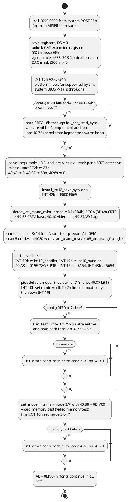

# Chips & Technologies 65535/A VGA BIOS

Module: `Chips 65535/A VGA 32KB BIOS`, `Version 2.0.0`, `Copyright (C) 1994 Chips and
Technologies, Inc.`, 32 KB at file offset 0, executing at segment `E000` in this image (the
system BIOS calls `E000:0003`) and aliased at the conventional `C000` (the MISER module checks
both). The listing uses segment `C000`. Files: [`disasm/vga.asm`](../disasm/vga.asm),
[`labels/vga.json`](../labels/vga.json), [`docs/generated/vga-ports.md`](generated/vga-ports.md).

The 65535 is C&T's flat-panel/CRT VGA controller for notebooks; this BIOS drives the STN colour
panel named in the system BIOS OEM string. A string `For Evaluation Use Only.` at `0C2A` shows
the build was an evaluation release from C&T.

## Header and entry

| Offset | Content |
|---|---|
| `0000` | `55 AA 40` – option ROM, 64 × 512 = 32 KB; the module checksums to zero |
| `0003` | `jmp 0044` → `jmp vga_init_main` (`267D`) |
| `0005` | `7400000000000000000000000IBM VGA Compatible BIOS.` – the IBM-compatibility marker that DOS-era software looks for |
| `0038-0047` | small parameter block (`1A 05 81 00 A0 01 B0 01`) |
| `008B`, `00AA`, `012B` | product, version and copyright strings |
| `017D-017F` | configuration flag bytes tested by the init code (`017D` bit 6/7, `017F` bit 4) |
| `019E` | `video_save_ptr_table` (EGA/VGA SAVE_PTR, installed at `40:A8`) |
| `0AF3-0AF6` | per-mode records (`mode_table_entries`) |
| `203C` | `mode_set_dispatch` |
| `2C08` | `int10_dispatch_table` |
| `2C44` | `int10_handler` |
| `5654-5E53` | 8×8 font (`font_8x8_lo` 00h-7Fh, `font_8x8_hi` 80h-FFh) |
| `5E54-6C53` | 8×14 font, `6C54` 9×14 supplement |
| `6D64-7D63` | 8×16 font, `7D64` 9×16 supplement |
| `7FFF` | checksum byte (`D7`) |

## Initialisation (`vga_init_main`, `267D`)

`install_far_vector` (`297C`) is the two-`stosw` helper used for every vector write (`AX` =
offset, `BX` = segment). The BDA fields the init writes are the standard EGA/VGA ones: `40:49`
mode, `40:63` CRTC base, `40:87` (bit 1 = mono, bits 5-6 memory size), `40:88`, `40:89`
(bit 0 = VGA active, bit 3/4 = scan lines), `40:8A`, `40:A8` SAVE_PTR.

## INT 10h

`int10_handler` (`2C44`) fast-paths `AH = 0Eh` (teletype, `4184`), `0Ch` (write pixel, `3FF4`)
and `0Dh` (read pixel, `40C0`). Everything else pushes all registers, sets `BP = SP`, `DS = 0`,
and for `AH < 1Dh` calls `int10_dispatch_table[AH]`:

| AH | Handler | AH | Handler |
|---|---|---|---|
| 00 | `int10_00_set_mode` → `mode_set_dispatch` | 0F | `int10_0F_get_mode` |
| 01 | `int10_01_set_cursor_type` | 10 | `int10_10_palette_dac` → `int10_10_dac_dispatch` (AL 00-1B) |
| 02 | `int10_02_set_cursor_pos` | 11 | `int10_11_font_services` |
| 03 | `int10_03_get_cursor_pos` | 12 | `int10_12_alt_select`: BL=10h `int10_12_bl10_get_ega_info`, 20h `int10_12_bl20_alt_prtsc`, 30h-36h `int10_12_bl30_dispatch` |
| 04 | `int10_04_read_light_pen` | 13 | `int10_13_write_string` |
| 05 | `int10_05_select_page` | 14 | `int10_14_lcd_loadfont` (LCD-specific, best guess) |
| 06 | `int10_06_scroll_up` | 15 | `int10_15_get_display_info` (best guess) |
| 07 | `int10_07_scroll_down` | 16-19 | unsupported |
| 08 | `int10_08_read_char_attr` | 1A | `int10_1A_display_combination` |
| 09 | `int10_09_write_char_attr` | 1B | `int10_1B_functionality_state` |
| 0A | `int10_0A_write_char` | 1C | `int10_1C_save_restore_state` → `int10_1C_state_dispatch` (AL 0-2) |
| 0B | `int10_0B_set_palette` | | |

For `AH >= 1Dh` the handler calls `int10_ext_functions` (`206A`, the C&T `AH = 5Fh` family:
panel/CRT selection, extended mode set, and the two BL-indexed tables `ext5F_bl_dispatch_a`
(18 entries) and `ext5F_bl_dispatch_b` (9 entries)). If the function is still unknown it
re-issues the call as `INT 42h`, i.e. hands it to the system BIOS's original INT 10h.

### Mode set

`mode_set_dispatch` (`203C`, 22 entries) maps the requested mode to a handler index:
modes 0-4 directly, C&T extended modes `50h-5Fh` to 4 + (mode − 50h), and `60h-62h` to 20-22.
Standard modes 5-13h are handled by the generic path before the table. Per-mode parameters come
from the records at `0AF3` (two bytes and a pointer per mode).

### Extended modes

`find_mode_record` (`17E2`) looks the requested mode up in `mode_number_list` (`0ADC`) and takes
the 4-byte record from `mode_entry_table_0AF3`, whose pointer selects the 64-byte parameter
block; modes with a flat-panel variant carry a second record that is used when the panel is
active (`panel_mode_check_advance_di`). Decoded in
[docs/generated/tables.md](generated/tables.md); the derived resolutions are:

| Modes | Resolution (from the CRTC values) | Notes |
|---|---|---|
| 20h, 30h, 79h | 640×480 | three colour-depth families of the same timing (flags BEh) |
| 22h, 32h, 7Ch | 800×600 | |
| 24h, 34h, 7Eh | 1024×768 | panel variant: 1024×384 (interlaced half frame for the STN panel) |
| 40h, 41h | 1280×480 CRTC (640×480 at 16 bpp, best guess: doubled horizontal count) | |
| 60h, 61h | 132×25 and 132×50 text (1056×400) | |
| 6Ah, 70h | 800×600 | 16-colour (GC 05/06 = 00/05) |
| 72h, 75h | 1024×768 | panel variant 1024×384; flags BAh |

The colour depth is not encoded in the record itself; it follows from the sequencer/GC bytes of
the block and the C&T extension-register list applied afterwards (`ct_ext_reg_lists`, `0B4B`).
The ROM also carries the string `For Evaluation Use Only.` (`str_evaluation_use_only`), printed
by the init code at `250A`: this C&T BIOS build is an evaluation release.

### Other dispatch tables found

| Table | Selected by | Entries | Purpose |
|---|---|---|---|
| `426A` | AL of AH=10h | 28 | palette / DAC / overscan / gray-scale functions |
| `471A` | BL−30h of AH=12h | 7 | scan lines, default palette loading, video enable, gray sum, cursor emulation, display switch, refresh |
| `4CFC` | AL of AH=1Ch | 3 | state buffer size / save / restore |
| `44C0` | AL of AH=11h, packed (low nibble | bits 4-5 >> 1) | 25 | character-generator sub-functions `int10_11_*` (load 8x8/8x14/8x16/user fonts, reprogram, set INT 1Fh/43h pointers, font info) - `int10_11_font_dispatch` |
| `0F6B`, `112D` | BL | 18, 9 | C&T extended (AH=5Fh) sub-functions; both preset `AL = 5Fh` as the success code |

### Mode parameter blocks and panel programming

`mode_param_ptr_for_al` (`5179`) finds the 64-byte parameter block of a mode: three 14h-byte
mode-number lists at `5116` (`supported_mode_list`, chosen by `mode_table_group_select` from the
scan-line flags `40:489`/`40:488`) give an index, `× 40h` selects the block in
`mode_parameter_tables` (`0047-08BE`: columns, rows, character height, page size, sequencer
1-4, misc output, CRTC 0-18h, attribute 0-13h, graphics 0-8), and a user table hooked at save-area
pointer 0 (`save_area_ptr_get`, `40:A8`) can override it. `mode_regs_program_all` /
`mode_regs_program_seq_misc_crtc` write the block; `mode_set_256color_fix` patches the
256-colour modes. The flat-panel side is a family of C&T extension-register helpers:
`panel_adjust_mode_bits` (XR57), `xr24_xr57_panel_program`, `xr55_*`, `xr28_write_mode_bits`,
`xr06_program_by_mode`, `xr0B_program_by_mode`, `panel_regs_table_by_type` (XR44 panel type
selects a register list at `1F3/1F9/205/20B`), `panel_regs_from_table` and `ct_regs_load_list`.
`display_device_query_hook` asks the system BIOS through **INT 15h AX=5F39h** which output
(CRT / panel / both) is wanted for the new mode, and `display_device_set_both` applies it.
Extended-mode addressing uses the bank registers XR10/XR11 (`linear_addr_from_cursor`,
`pixel_addr_8bpp`, `pixel_addr_1bpp`, `xr10_write_bl`).

### Video-memory test and adapter detection

`vram_test_prepare` / `vram_plane_test` (`28DB`, `2A78`) fill and verify each plane through the
GC map mask with the screen off (`init_error_beeps` reports failures); `detect_crt_mono_color`
probes CRTC `3B4h`/`3D4h` (`crtc_reg_probe`) and sets `40:463`/`40:410`; `vga_enable_46E8_3C3`
wakes the adapter unless XR70 says it is already active.

### Fonts, 9-dot text and print screen

`font_load_to_plane2` (INT 10h AH=11h) opens plane 2 (`font_plane2_access_open`), copies glyphs
with `font_copy_rows` into the 8 KB font block chosen by `font_block_addr`, and for 9-dot text
modes `font_9dot_patch_load` overwrites the box-drawing characters listed at `6C54` (8×14) and
`7D64` (8×16) so their 9th column repeats the 8th; `font_plane2_access_close` restores the
text mapping. `default_font_select_by_height` picks 8×8 / 8×14 / 8×16 from `40:485`, and a
user font hooked in the save area is loaded by `alpha_font_override_load`. The ROM also carries
the **INT 05h print-screen handler** (`int05_print_screen`, status byte `40:500`, output through
`print_screen_char_int17`), the video state save/restore of AH=1Ch (`save_video_state_regs`,
`save_video_bda_state`, `restore_video_bda_state`), and the default DAC palette loader
(`dac_default_load`, `dac_load_run_list`, `dac_ega_color_map`, gray-scale summing
`dac_rgb_gray_scale` with 30/59/11 % weights).

## Fonts

| Address | Font | Size |
|---|---|---|
| `5654` | 8×8, chars 00h-7Fh (INT 43h default) | 1024 |
| `5A54` | 8×8, chars 80h-FFh (INT 1Fh) | 1024 |
| `5E54` | 8×14 | 3584 |
| `6C54` | 9×14 supplement (code, 14 bytes) | 272 |
| `6D64` | 8×16 | 4096 |
| `7D64` | 9×16 supplement (code, 16 bytes) | to end |

## Drawing primitives and how they work

There is no line-drawing, fill or general BitBLT entry point in this ROM. Like every VGA BIOS of
the period it offers pixels, characters, strings and scrolling; the 65535 has no drawing engine
that the BIOS would expose. The closest things to a blit are the scroll routines, which move
whole character rows with string instructions, and the planar scroll which uses the VGA latches
to move all four planes at once. Everything below runs with `DS = 0` (BDA) and `BP = SP` frame
of the pushed registers; return values are written into the saved registers on the stack
(`[bp+10h]` = AX, `[bp+0Eh]` = BX, `[bp+0Ch]` = CX, `[bp+0Ah]` = DX).

| Primitive | Routine | Method |
|---|---|---|
| write pixel, planar modes 0Dh-12h and C&T extended | `write_pixel_planar` `4008` | address = `y × bytes_per_row (40:4A) + x/8` plus `BH × page size (40:4C)`; graphics controller 00h set/reset := colour, 01h enable set/reset := 0Fh, 08h bit mask := `80h >> (x & 7)`; one `or [bx], al` performs the read-modify-write through the latches; XOR when AL bit 7 via GC 03h = 18h; afterwards 08h := FFh, 00h/01h := 0 |
| write pixel, mode 13h | `write_pixel_mode13` `3F94` | byte store at `A000:(y × 140h + x)` |
| write pixel, CGA modes 4-6 | `write_pixel_cga` `3FB8` + `cga_pixel_address` `4124` | `B800`, interleaved banks (`+2000h` for odd rows), 2 bpp or 1 bpp mask/shift, OR or XOR |
| read pixel | `read_pixel_planar` `40D4`, `read_pixel_mode13` `4078`, `read_pixel_cga` `4098` | planar: GC 04h read-map-select 3..0, collect one bit per plane |
| write character, text modes | `int10_09_write_char_attr` / `int10_0A_write_char` `3BC2`/`3C56` | `text_cell_address` then `rep stosw` (char+attr) or `stosb`; on a real CGA (40:87 bit 2) each store waits for horizontal retrace on `3DAh` to avoid snow |
| write character, CGA graphics | `write_char_cga` `3CDA` | glyph rows from INT 43h (chars 00-7Fh) or INT 1Fh (80h-FFh); 4 row pairs across the two banks; mode 6 stores bytes, modes 4/5 expand 1 bpp → 2 bpp with `planar_char_row_write`; XOR when BL bit 7 |
| write character, planar graphics | `write_char_planar` `3D81` | set/reset = colour, enable set/reset = ~colour, map mask 0Fh; then one `movsb` per glyph row with `DI += bytes_per_row`; XOR variant `write_char_planar_xor` `3E04` uses GC 03h = 18h |
| write character, mode 13h | `write_char_mode13` `3E25` | each glyph row expanded bit by bit into 8 bytes, foreground BL / background BH, 138h to the next scan line |
| read character | `read_char_attr_body` `394A` | text: read the word; CGA: reverse-match 8 rows against the font (`expand_byte_to_pixels`); planar: `1D43`; mode 13h: `3ADD` |
| scroll, text | `scroll_text` `34C8` | row-by-row `rep movsw` (DF set for scroll-down) then `rep stosw` of blanks with attribute BH; full-width windows are done as one block copy |
| scroll, CGA graphics | `scroll_cga` `35D2` | both interleaved banks moved with `movsw`/`movsb`, 140h bytes per row, 4 or 8 scan lines per text row |
| scroll, planar | `scroll_planar` `374E` | GC 05h write mode 1 (latch copy) + sequencer map mask 0Fh: `rep movsb` moves all four planes per byte; vacated rows filled through set/reset with `rep stosb` |
| scroll, mode 13h | `scroll_mode13` `3884` | `rep movsw` per row (8 bytes per column), fill with the attribute byte |
| teletype | `int10_0E_teletype` `4184` | handles BEL (`speaker_beep`), BS, LF, CR; wraps and scrolls one line via `int10_06_scroll_up`; updates the CRTC cursor directly for page 0 |
| write string | `int10_13_write_string` `49EE` | per character: set cursor, `int10_09_write_char_attr` (attribute from string when AL bit 1), CR/LF/BEL/BS through teletype |
| palette / DAC | table `int10_10_dac_dispatch` | attribute registers via `attr_reg_write` (waits for vertical retrace), DAC via 3C7h-3C9h with the screen blanked (`screen_off`) during block loads |
| fonts | `int10_11_font_services` `44F2` | user font load, ROM 8×8/8×14/8×16 selection, INT 43h/1Fh pointers, `40:85` char height |
| save / restore state | `int10_1C_*` | `state_buffer_size`, `save_hardware_state` / `restore_hardware_state`, BDA copy |

Register-access idioms that appear everywhere: `ct_ext_read` (`3D6h` index → `AH`), `ct_ext_write`
(`AX` to `3D6h`), `idx_reg_read_next`/`idx_reg_read_word` for the standard indexed ports,
`screen_off`/`screen_on` (sequencer clocking-mode bit 5) around anything that reprograms timing,
and `call_int15_5F_hook` (`AX = 5F33h/5F34h/5F38h`) to tell the system BIOS about mode changes.

## The C&T AH=5Fh extension functions

`int10_5F_dispatch` (`206A`) maps AL through `ct5F_function_table` (`203C`): AL 00h-04h,
50h-5Fh and A0h-A2h (AL=10h is an alias of 03h). Calls with an index below 20 are bracketed by a
save of `40:49` and the sequencer index. Return convention: AL = 5Fh means supported, FFh not.

| AX | Routine | Behaviour |
|---|---|---|
| 5F00 | `ct5F00_get_controller_info` | BL = ext reg 00h (chip ID), BH = ext reg 04h & 3 (memory size), CX = 0114h (BIOS 1.14), DX = 0, AH = 1 |
| 5F01 | – | unsupported |
| 5F02 | `ct5F02_set_display_type` | BH = FFh default, 2-7 select a panel/CRT combination |
| 5F03 (5F10) | `ct5F03_get_display_config` | BX/CX/DX/SI/DI describe the active display and geometry (from ext 0Fh, CRTC 01h) |
| 5F04, 5F50 | `ct5F04_get_panel_info` | BX = panel width, CX = height (constants at `01D6`/`01D8`), DX = capability flags |
| 5F51 | `ct5F51_select_display_device` | BL = 0 CRT / 1 LCD / 2 both → ext reg 1Fh bits 0-1, then the current mode is reprogrammed (this is what SETUP's *Display Device* and the hot key use) |
| 5F52 | – | unsupported |
| 5F53, 5F54, 5F5D | nops | return success |
| 5F5A | `ct5F5A_set_ext61_bit7` | ext reg 61h/63h bit 7 := BL bit 0 |
| 5F5B | `ct5F5B_nop` | AL = 5Fh, AH = 0 |
| 5F5C | `ct5F5C_panel_adjust` | BL 00h-11h: text stretching, centering, expansion, panel enable/disable through ext regs 24h/44h/51h/57h/58h/59h/5Ah |
| 5F5E | `ct5F5E_set_video_polarity` | BL 0/1 normal/reverse video (ext 59h/0Fh/57h bits), BL 2/3, BL 4/5 |
| 5F5F | `ct5F5F_color_mapping` | BL 0-7, 0Fh: gray-scale/colour mapping in ext 55h/56h (SETUP *MaxContrast / SmartMap*) |
| 5FA0 | `ct5FA0_get_state_size` | like INT 10h 1Ch AL=0 |
| 5FA1 | `ct5FA1_save_restore_state` | extended save/restore |

## Ports

The BIOS touches the standard VGA register set (`3B4/3B8/3BA`, `3C0-3CF`, `3D4/3D8/3DA`) plus the
C&T extension index/data pair `3D6h/3D7h` (unlocked with index `6Fh`). See
[`docs/generated/vga-ports.md`](generated/vga-ports.md).
