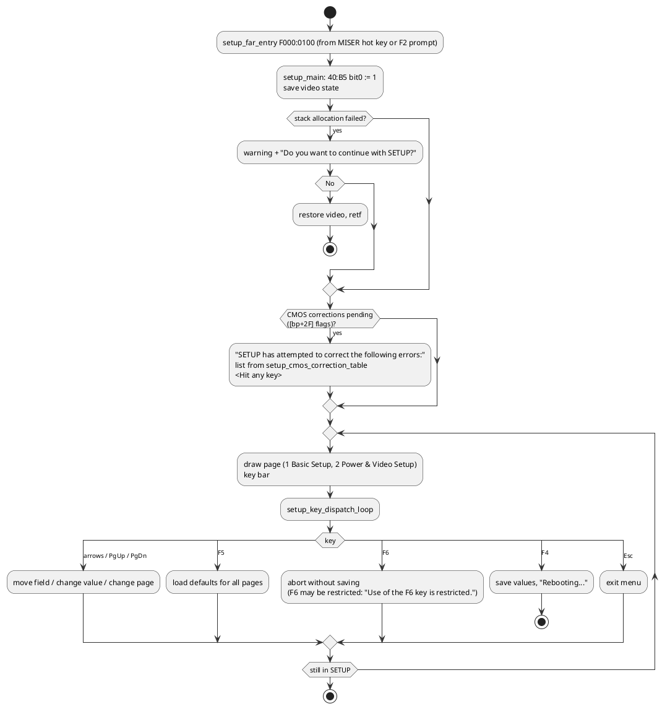
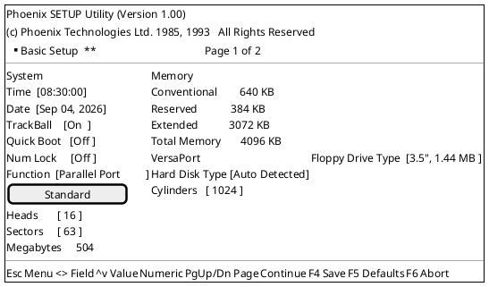
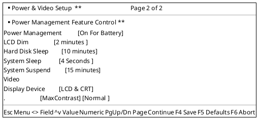
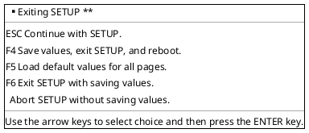
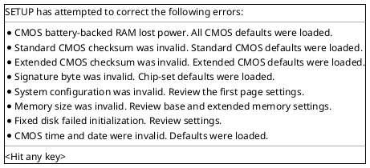

# Phoenix SETUP utility

`Phoenix SETUP Utility (Version 1.00)`, `(c) Phoenix Technologies Ltd. 1985, 1993`. It lives in
the low part of the system BIOS segment: code at `F000:0100-03F1` and `F000:1530-57FF`, strings
at `F000:03F2-152F`. Listing [`disasm/sys.asm`](../disasm/sys.asm).

## Hot keys (work after boot, from the DOS prompt)

The INT 15h AH=4Fh keyboard intercept (`int15_4F_kbd_intercept`, `C030`) is live whenever the
BIOS keyboard handler is, so these work at the DOS prompt as well as during POST (not inside
Windows enhanced mode, which MISER detects with INT 2Fh AX=1600h and refuses):

| Keys | Alternative raw scancode (Fn combination) | Action |
|---|---|---|
| Ctrl+Alt+S | – | SETUP (`int15_4F_setup_hotkey_check`, scancode from ROM byte `AF65` = 1Fh) |
| Ctrl+Alt+F3 | 65h | SETUP (`hotkey_setup`) |
| Ctrl+Alt+F4 | 66h | toggle display LCD / CRT / both (`hotkey_display_toggle`, INT 10h 5F50h/5F51h) |
| Ctrl+Alt+F8 | 6Ah | show the POWER METER battery gauge overlay (`hotkey_power_meter`, MISER API 30h) |
| F2 | – | SETUP from any POST/boot error prompt (`wait_key_f1_f2`) |

The scancodes 65h/66h/6Ah are not produced by a standard keyboard; they come from the notebook's
keyboard controller for Fn+F3/F4/F8 (best guess based on the pairing with the Ctrl+Alt codes).
The remaining Fn keys – brightness up/down, contrast up/down, volume up/down – never reach the
keyboard handler: the chipset raises an SMI and PhoenixMISER's `pm_evt_fn_hotkey` changes the
panel byte on port 1FFh (mirrored in CMOS 3Fh) or the Sound Blaster DSP volume; see
[03](03-phoenixmiser.md#pop-up-setup-from-the-smi-and-the-fn-hot-keys). SETUP started from a
hot key runs as a pop-up inside that machinery (video memory parked in shadow RAM, PICs masked,
own keyboard service), which is why it works from DOS but is refused under Windows enhanced mode.

## Entry and exit

| Address | Role |
|---|---|
| `F000:0100` `setup_far_entry` | far-callable entry, `jmp setup_main`. Called by PhoenixMISER (`lcall F000:0100` from `call_system_setup` `E800:061D`, the Ctrl+Alt+S hot-key path goes through the MISER keyboard hook) and used when F2 is pressed at a POST/boot prompt |
| `1934` `setup_main` | `DS = 0`, set `40:B5` bit 0 (SETUP active), save video mode / page / cursor (INT 10h 0Fh/03h), draw the screens, run the key loop; returns with `retf` |
| `1B18` `setup_key_dispatch_loop` | scans 3-byte `(key, handler)` records copied to the stack frame (`[bp+4D]` ASCII keys, `[bp+5D]` extended keys) and calls the handler |
| `1CD0` `setup_cmos_correction_table` | 8 × `{msg ptr, flag mask, clear mask, handler}` driving the "SETUP has attempted to correct the following errors" screen |
| `3F6F` | `Rebooting...` – F4 save path ends in a reboot |

POST checkpoint codes `44h-47h` are emitted from inside SETUP (`1B89`, `1B9B`).

The utility needs stack space from system RAM; if it cannot allocate it the warning at `046F`
appears (*SETUP was not able to allocate memory for stack space from system RAM. Returning to DOS
will not interfere with resident applications. Continuing, however, will require that you reboot
the system.*), then *Do you want to continue with SETUP?* with `Yes` / `No`.

## Screens

Reconstructed from the strings and their order; positions are approximate.

### Page 1 – Basic Setup

Field value lists (from the string table):

| Field | Values |
|---|---|
| Date months | `Jan Feb Mar Apr May Jun Jul Aug Sep Oct Nov Dec` |
| Floppy Drive Type | `Not Installed`, `5.25", 360 KB`, `5.25", 1.2 MB`, `3.5", 720 KB`, `3.5", 1.44 MB`, `3.5", 2.88 MB` |
| Hard Disk Type | `Not Installed`, `Type 1` … `Type 43`, `Auto Detected`, `AUTO 2`, `User Defined`, `USER 2`, `Type 48`, `Type 49` (types 1-47 index `hd_param_table`; `User Defined` opens the Cylinders / Heads / Write Precomp / Landing Zone / Sectors / Megabytes editor, `Drive Table Entry Unused` when empty) |
| VersaPort Function | `Parallel Port`, `External floppy drive`, `Enhanced Parallel Port` |
| VersaPort mode | `Standard`, `Bidirectional`, `Version 1.7`, `Version 1.9` (EPP versions) |
| TrackBall / Quick Boot / Num Lock | on/off style two-value fields (4-character boxes) |

### Page 2 – Power & Video Setup

| Field | Values |
|---|---|
| Power Management | `Off`, `On Always`, `On For Battery` |
| LCD Dim | `Off`, `1 minute`, `2 minutes`, `4 minutes`, `6 minutes`, `8 minutes`, `12 minutes`, `16 minutes` |
| Hard Disk Sleep | `Disabled`, `5 minutes`, `10 minutes`, `15 minutes`, `20 minutes`, `30 minutes`, `40 minutes`, `60 minutes` |
| System Sleep | `Disabled`, `1 Second`, `4 Seconds`, `8 Seconds`, `16 Seconds` |
| System Suspend | `Disabled`, `5 minutes` … `60 minutes`, plus `Off`, `1 minute`, `2 minutes`, `5 minutes`, `10 minutes`, `15 minutes` variants |
| Display Device | `CRT`, `LCD`, `LCD & CRT` |
| Panel options | `MaxContrast` / `SmartMap`, `Normal` / `Reverse` (STN panel contrast and video polarity) |
| CPU speed | `Full Speed` (string at `152C`; the other speeds come from `rom_option_cpu_speeds`) |

The timeouts correspond to the device records that PhoenixMISER keeps in its private RAM
(`pm_subfn_dispatch`), so this page is effectively the MISER configuration UI.

### Exit menu (Esc)

(The strings for F6 read *Exit SETUP with saving values* / *Abort SETUP without saving values*
in two halves; the F6 key can be disabled by the OEM: *Use of the F6 key is restricted. Please
press the F4 key to reboot the system.*)

### CMOS correction report

Shown at start-up when POST found problems. Each line is enabled by a bit in the correction
flags (`[bp+2F]`) and its handler from `setup_cmos_correction_handlers` runs when the user
continues:

| Handler | Fixes |
|---|---|
| `fix_cmos_power_lost` | CMOS 0Dh bit 7 clear → load all defaults |
| `fix_std_cmos_checksum` | 10h-2Dh checksum vs 2Eh/2Fh |
| `fix_ext_cmos_checksum` | Phoenix extended area checksum |
| `fix_signature_byte` | chipset signature byte → chipset defaults |
| `fix_system_config` | equipment / configuration bytes |
| `fix_memory_size` | base / extended sizes vs POST results |
| `fix_fixed_disk_init` | disk type failed `INT 13h` init |
| `fix_time_date` | RTC out of range |

### Hard disk detail table

`Drive  Type  Cylinders  Heads  Write Precomp  Landing Zone  Sectors  Megabytes` with a
`<hit any key>` footer – the display used by the `User Defined` editor and the drive-table view.

## Field records and the CMOS bytes they edit

The pages are data driven. `setup_select_page` (`2621`) loads, for page *n*, the last field
index from `03CC`, a word from `03CE`, the field-record array pointer from `03D2` (page 1 →
`014C`, page 2 → `1874`) and the 14-byte page descriptor from `03D6` (title, left/right label
blocks as runs of consecutive NUL-terminated strings, printed one per row by `setup_print_at`).
Each field is a 32-byte record: row, column, value-string pointer, seven handler pointers, the
CMOS location at `+14h` (index in the low byte, bit mask in the high byte), range/option data at
`+16h`/`+18h`, and a kind byte at `+1Fh` (66h option list, 22h disk-type list, 00 numeric).
That gives the CMOS map of everything SETUP can change:

| Page / field | CMOS index | Bits | Values (option list) |
|---|---|---|---|
| Time hh:mm:ss, Date | 04h/02h/00h, 07h/08h/09h | BCD | edited digit by digit (handlers `3C77`…`3D91`) |
| TrackBall | 59h | bit 5 | Off / On (0F7B/0F73) → equipment word bit 2 at POST |
| Quick Boot | 58h | bit 7 | No / Yes → with CMOS 34h bits 4/7 lets POST skip the memory and keyboard tests (`40:B6` bit 0). PhoenixMISER sets this bit after a save-to-disk and clears it when the image has been restored (`cmos58_bit7_write`), so a pending image always gets a quick POST |
| Num Lock | 1Fh | bit 5 | Off / On (initial Num Lock state) |
| VersaPort Function | 59h | bits 0-1 | Parallel Port / External floppy drive / Enhanced Parallel Port (0F8B) |
| VersaPort mode line | 59h | bit 2 (+ EPP version) | Standard / Bidirectional (12CA+) or Version 1.7 / 1.9 |
| Conventional / Extended / Total memory | 15h-16h / 17h-18h | word | display only (`setup_draw_memory`) |
| Floppy Drive Type | 10h | bits 4-7 | Not Installed / 360 KB / 1.2 MB / 720 KB / 1.44 MB / 2.88 MB (0C62) |
| Hard Disk Type | 12h | bits 4-7 (+19h ext) | 47 entries + Auto Detected / AUTO 2 / User Defined / USER 2 (0CB7, kind 22h) |
| Cylinders / Heads / Sectors (user type) | 20h-2Fh (via handlers) | | limits 9999 / 99 / 99 |
| Power Management | 42h | bits 0-1 | Off / On Always / On For Battery (1351) |
| LCD Dim | 4Ah | bits 0-2 | Off / 1 / 2 / 4 / 6 / 8 / 12 / 16 minutes (13AB) |
| Hard Disk Sleep | 4Bh | byte | Off / 1 / 2 / 5 / 10 / 15 minutes (14EA) |
| System Sleep | 44h | bits 0-2 | same list as LCD Dim (13AB) |
| System Suspend | 45h | bits 0-2 | same list as LCD Dim (13AB) |
| Display Device | 5Eh | bits 6-7 | CRT / LCD / LCD & CRT (1284) → applied through INT 10h 5F51h |
| (panel attributes) | 5Eh | other bits | MaxContrast / SmartMap, Normal / Reverse (12A2) |
| (no SETUP field found) | 43h bits 0-2 / 3-5, 44h bits 3-5, 46h bits 0-2 / 3-5, 4Eh bit 0, 4Ch bit 4 | | read by the PhoenixMISER `config_records` (activity counters, chipset reg 0Dh field, short suspend list) – see [03](03-phoenixmiser.md#configuration-records-setup--power-management) |
| Page 3 (patched `xtide-setup` variant only) | 60h bits 0 / 1 / 2-3 / 4 / 5-6, 61h bits 0-1 / 2-3 / 4-6 | | XTIDE Settings, IDE Controllers, Default Boot Drive, Block Mode, Write Cache, Master/Slave Translation, Standby Timer; unused by the factory firmware, inside the extended checksum range – see [11](11-patched-rom.md#variant-xtide-setup-a-third-setup-page) |

The alternative timeout lists at `1403`, `145B` and `1492` (`Disabled`, 5-60 minutes; 1-16
seconds) exist in the string table but are not referenced directly by the six page-2 records.
The PhoenixMISER `config_records` decode CMOS `45h` (System Suspend) as Off / 5 / 10 / 15 / 20 /
30 / 40 / 60 minutes, which is exactly the `1403` list, so that list is the one the Suspend
field really means; LCD Dim and System Sleep use the 1-16 minute list (`13AB`). CMOS
`42h`/`44h`/`45h`/`4Ah`/`4Bh` are what the PhoenixMISER timers read (chipset register `0Dh`
holds the three 3-bit timeout fields).

## Implementation notes

The patched `xtide-setup` variant ([11](11-patched-rom.md)) adds a third page by extending the
page tables described here; it is a useful worked example of the record format.

**Work area.** `setup_main` (`1934`) needs 4 KB of RAM for its frame. In the listings and sources the
frame fields appear as `setup_frame.<name>` and the record fields as `setup_field_rec.<name>` (defined in
`labels/vars.json`, reference in [generated/variables.md](generated/variables.md#structures)). `setup_frame_segment`
(`244D`) takes PhoenixMISER's spare segment `DF00h` when the module is initialised (API `0040h`
/ `0038h`), otherwise `setup_find_free_top_memory` scans down from top-of-memory minus 36 KB for
an all-zero 4 KB block; if none is free the warning at `046F` appears. Everything lives in that
frame, addressed from BP:

| Offset | Content |
|---|---|
| `[bp+0..]` | scratch text buffer for value formatting |
| `[bp+15]` | CRTC index port (3D4h/3B4h) |
| `[bp+17..21]` | attribute set (`setup_attributes_init` mono 07h/70h/0Fh..., `setup_attributes_color` 70h/1Fh/3Eh/4Fh...) |
| `[bp+25]` | current page (0 Basic, 1 Power & Video), `[bp+28]` field count, `[bp+2B]` current field, `[bp+26]` record array, `[bp+2C]` field value array (one byte per field), `[bp+29]` page descriptor |
| `[bp+2E]` | flags: bit 0 something changed, bit 1 reloading |
| `[bp+2F]` | CMOS correction flags (see the correction report) |
| `[bp+31..4B]` | legend string pointers (`setup_init_legend_strings`) |
| `[bp+4D]`, `[bp+5D]` | key maps copied from `setup_key_maps` (`0103h`/`0129h` ASCII, `0113h`/`0139h` extended) |
| `[bp+65..D6]` | **CMOS shadow**: `cmos_shadow_load` copies CMOS 0Eh-7Fh here at start; every field edits the shadow (`cmos_shadow_read`/`cmos_shadow_write`) and `cmos_shadow_flush` writes it back only when the user saves |

**Field records.** `setup_select_page` (`2621`) loads the page tables at `03CC` (field
count), `03CE` (value array), `03D2` (record array: `014C` page 1, `1874` page 2) and `03D6`
(14-byte page descriptor with title/label string blocks). Each 32-byte record: `+0/+1` row/col,
`+2` value-string list, `+4` next-value handler (`+`, Right), `+6` draw handler, `+8` alternate
handler, `+A` common (`setup_field_common`), `+C` previous-value handler (`-`, Left), `+E`
Enter/edit handler, `+10` CMOS-read handler, `+12` CMOS-write handler, `+14` CMOS index /
`+15` bit mask, `+16` maximum, `+18` shift, `+19` default, `+1A/+1C/+1D` secondary handler and
label position, `+1E` value type (11h/12h = text in the frame), `+1F` kind (66h option list, 22h
disk type, 33h/44h/77h/78h user-geometry rows, 55h field with secondary label). The generic
handlers are `list_field_next_value` / `list_field_load_from_cmos` / `list_field_prev_value` /
`list_field_write_cmos` / `setup_ext_checksum_to_shadow` for option lists, `numeric_field_key_edit` for numbers, and the
per-subject ones (`floppy_A_*`, `hd_field_*`, `hd2_*`, `versaport_*`, `time_*`, `date_*`,
`user_geom_*`, `base_memory_*`, `ext_memory_*`, `total_memory_field_read`, `display_field_*`).

**Keys** (`setup_key_dispatch_loop` `1B18`, maps in `setup_key_maps`): Up/Down (`setup_field_prev`
/ `setup_field_next`, skipping hidden rows), PgUp/PgDn (`setup_key_pgup` / `setup_key_pgdn`
switch page), Right / `+` / Space (`setup_key_next_value`), Left / `-` (`setup_key_prev_value`),
Enter (handler `+E`, e.g. the disk-type chooser `hd_type_list_screen`), digits and Backspace
(numeric editors), Esc (`setup_key_escape`: exit menu). In the exit menu: **F4** saves
(`cmos_shadow_flush`, sets `40:B6` bit 6 so PhoenixMISER re-reads its configuration
records) and leaves via `setup_exit`; in the pop-up F4 becomes `setup_save_and_reboot`
(flush + `setup_reboot`); **F5** reloads the values from CMOS and the hardware
(`cmos_set_base_memory`, `cmos_set_ext_memory`, `cmos_set_equipment_14`), discarding edits;
**F6** exits without saving (after `setup_confirm_box` when something changed). Unknown keys
beep (`setup_key_default`, PIT channel 2).

**Pop-up mode.** `setup_in_popup` (`15FE`, `40:B6` bit 1 set by MISER's `bda_popup_mark_set`)
switches the keyboard source to `popup_read_key`, which polls the keyboard controller directly
and translates scancodes itself (the BIOS INT 16h is not usable inside the SMI-created context,
see [03](03-phoenixmiser.md#pop-up-setup-from-the-smi-and-the-fn-hot-keys)); it also picks
the pop-up key maps and skips the DOS clock update.

**Clock.** The time/date rows are live: `setup_draw_time_date` re-reads the RTC whenever the
seconds change (`rtc_wait_uip_snapshot_sec` / `rtc_seconds_changed`), edits go straight to the
RTC (`rtc_write_time` / `rtc_write_date`), and on exit `rtc_to_dos_time_date` pushes the new
time into `40:6C` and the date into DOS through INT 21h AH=2Bh when DOS is present.
`rtc_validate_or_reset` resets an invalid clock to 00:00:00 01/01/1990.

**Hard disks.** Types 1-46 come from the ROM table (`hd_type_detail_draw` shows
cylinders/heads/sectors/MB), *Auto Detected* (2Fh) runs IDENTIFY DEVICE right from SETUP
(`ide_identify_geometry`), and *User Defined* types 2Eh/2Dh keep their geometry in CMOS
`20h-2Fh` (drive 1) and `35h-3Fh` (drive 2): cylinders, heads, write-precompensation, landing
zone and sectors, edited by `user_geom_key_edit`. The OEM can override the type list through
the `PTL` record of the INT 15h C0h configuration table (`sysconfig_ptl_lookup`,
`rom_option_far_ptr_table` via `F000:FF64`).

**Checksums.** `setup_cmos_write_field` recomputes the standard checksum (10h-2Dh -> 2Eh/2Fh)
and `setup_cmos_read_field` the Phoenix extended one (40h-7Dh -> 7Eh/7Fh) in the shadow after
every edit, so the flushed image is always consistent.
