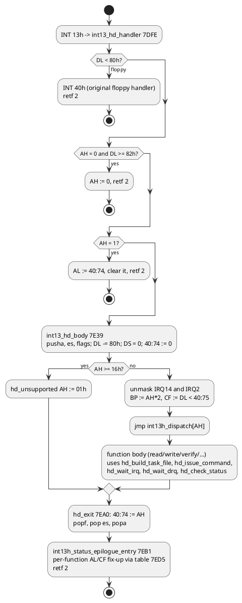

# INT 13h hard-disk driver (and notes toward an LBA patch)

The hard-disk code is a self-contained IDE/ATA driver in the system BIOS at `F000:7B5E-8600`
with the drive-type table at `E401` and the auto-detect code at `9C03-9E28`. This document
describes it end to end because it is the part that has to change for LBA support.

## Installation at POST

`hd_init` (`7C40`, called at POST 57h) does the following:

1. Reads CMOS `0Eh` (skip if bits 3/6/7 say the disk config is bad) and CMOS `12h`
   (drive 0 type in the high nibble, drive 1 in the low nibble).
2. `hd_type_to_param_ptr` turns a type into a parameter-table pointer:

   | Type nibble | Extended type (CMOS 19h / 1Ah) | Table used |
   |---|---|---|
   | 0 | – | no drive |
   | 1-Eh | – | `hd_param_table + (type-1) × 16` |
   | Fh | 1-2Fh | `hd_param_table + (ext-1) × 16` (types 16-47) |
   | Fh | 30h | user-defined: 16 bytes built at `40:C0` from CMOS `20h-2Fh` (`hd_user_params_from_cmos`) |
   | Fh | 31h | user-defined: built at `40:D0` from CMOS `35h-..` |
   | Fh | > 31h | `Fixed disk configuration error` |

   Types 44-47 (`Auto Detected`, `AUTO 2`, `User Defined`, `USER 2` in SETUP) are zero in the
   ROM. `hd_autodetect_patch_table` fills them **in the shadow-RAM copy of the BIOS** before this
   point: for 44/45 it issues ATA IDENTIFY DEVICE (`ata_identify_to_table`) and writes
   cylinders (word 1), heads (word 3) and sectors (word 6) into the entry; for 46/47 it copies the
   CMOS user parameters. It then subtracts the bytes it wrote from `rom_checksum_adjust_byte`
   (`F000:FFEF`) so the shadow copy still sums to zero.
3. Saves the current INT 13h (floppy, `int13_floppy_entry` → `A10B`) as **INT 40h**, installs
   `int13_hd_handler` (`7DFE`) as INT 13h, `int76_hd_irq` (`7DDE`) as INT 76h, and points INT 41h
   / INT 46h at the drive 0 / drive 1 parameter tables.
4. `40:74` status := 0, `40:75` drive count := 1 or 2, `40:76`/`77` := 0.
5. Waits up to 60 s for the controller to become ready (`hd_wait_ready_60s`; `Fixed disk
   controller failure` otherwise), then per drive: AH=10h ready (tick-limited), AH=09h init
   parameters, AH=11h recalibrate (retried), AH=08h params, AH=04h verify sector 1. Failures
   print `Fixed disk failure` and set CMOS `0Eh` bit 3.

## Runtime handler

### Function table (`int13h_dispatch`, `7E72`)

| AH | Routine | ATA command | Notes |
|---|---|---|---|
| 00 | `hd_00_reset` | – | INT 40h reset, `3F6h` 04h/00h pulse, then 09h + 11h for each drive |
| 01 | (inline in handler) | – | returns `40:74` |
| 02 | `hd_02_read_sectors` | 20h | PIO, 256 `insw` per sector, IRQ14 per sector |
| 03 | `hd_03_write_sectors` | 30h | 256 `outsw` per sector |
| 04 | `hd_04_verify_sectors` | 40h | |
| 05 | `hd_05_format_track` | 50h | writes the interleave table |
| 08 | `hd_08_get_params` | – | from the parameter table; DL = `40:75` |
| 09 | `hd_09_init_params` | 91h | heads-1 / spt from the table |
| 0A / 0B | `hd_0A_read_long` / `hd_0B_write_long` | 22h / 32h | 512 + 4 ECC bytes (3 extra bytes handled separately) |
| 0C | `hd_0C_seek` | 70h | |
| 0D | `hd_0D_reset_alt` | – | reset without the floppy step |
| 10 | `hd_10_test_ready` | 00h | task-file write only |
| 11 | `hd_11_recalibrate` | 10h | |
| 14 | `hd_14_diagnostics` | 90h | error reg 01h = pass |
| 15 | `hd_15_get_type` | – | AH=3, CX:DX = (cyl-1) × heads × spt |
| others | `hd_unsupported` | – | AH = 01h |

### CHS to task-file mapping (`hd_build_task_file`, `831B`)

The BDA bytes `40:441-448` hold the task-file image that `hd_issue_command` copies to
`1F1h-1F7h`:

| BDA | Register | Source |
|---|---|---|
| 442 | 1F1h write precomp | table wpcomp / 4 |
| 443 | 1F2h sector count | AL |
| 444 | 1F3h sector number | CL & 3Fh |
| 445 | 1F4h cylinder low | CH |
| 446 | 1F5h cylinder high | CL bits 6-7, **plus DH bits 5-7 as cylinder bits 10-12** |
| 447 | 1F6h drive/head | `A0h | drive << 4 | head` (head masked to 3 or 4 bits depending on heads ≤ 8) |
| 448 | 1F7h command | AH |
| 40:76 | 3F6h control | table control byte (bit 3 = more than 8 heads) |

The DH-bits trick is a Phoenix extension that lets the CHS interface address up to 8192
cylinders with 16 heads, but only if the caller knows about it; DOS does not. Nothing sets the LBA
bit (bit 6) of `1F6h` anywhere in the ROM.

Completion is interrupt driven: `int76_hd_irq` sets `40:8E = FFh` and calls INT 15h AX=9100h;
`hd_wait_irq` first calls INT 15h AX=9000h (device busy hook used by MISER for power saving) and
then polls with a timeout derived from `40:BE`. On timeout it resets the controller through
`3F6h` and returns AH = 80h.

### Error mapping (`hd_check_status`)

| Condition | INT 13h AH |
|---|---|
| error reg bit 7 (bad block) | 0Ah |
| bit 4 (ID not found) | 04h |
| bit 0 (address mark not found) | 02h |
| bit 6 (uncorrectable ECC) | 10h |
| bit 1 (track 0 not found) | 05h |
| bit 2 (aborted) with status DF (write fault) | CCh |
| … status DRDY clear | AAh |
| … status DSC clear | 40h |
| status ERR clear, CORR set | 11h |
| timeouts | 20h (controller), 80h (no interrupt) |

## Data used by the driver

- `hd_param_table` `E401`: 47 × 16 bytes (see [02](02-system-bios-runtime.md#data-tables));
  entries 44-47 (`E6B1-E6F0`) are filled at run time in shadow RAM.
- BDA: `40:74` status, `40:75` count, `40:76` control, `40:77` port offset (unused), `40:8C/8D`
  last status/error, `40:8E` IRQ flag, `40:BE` timeout base, `40:C0/D0` user parameter blocks,
  `40:441-448` task-file image, `40:448` bit 0 set when a request spans more than one sector.
- CMOS: `12h` types, `19h/1Ah` extended types, `20h-2Fh` / `35h-..` user parameters, `0Eh` bit 3
  "fixed disk init failed".

## Integrity checks that a patch must respect

| Check | Range | Behaviour |
|---|---|---|
| `rom_checksum_core` (POST 03h) | 8-bit sum of `F000:5800-FFFF` must be 0 (params at `ACE0`/`ACE2`: segment F580h, length A800h). The image satisfies this. | result is discarded by a `jz $+4` at `5C30`, but keep it zero anyway because `hd_autodetect_patch_table` maintains the byte at `FFEF` on that assumption |
| `post_copyright_integrity_check` (`5C30`) | sum of `E020-E2C2` (2A3h bytes) folded with the byte at `E840` | on mismatch the machine hangs in an obfuscated loop. **Never modify `E020-E2C2` or `E840`.** |
| VGA option ROM | `E000:0000-7FFF` sums to 0 | checked by `scan_option_roms` |

## Sketch of an LBA patch (for a separate copy of the image)

Free space that is neither checksummed nor protected: `F000:4000-4FFF` (4 KB of `FFh`).
Additional zero bytes inside the checksummed area that can be repurposed: `F000:E6F1-E6F4`,
`E705-E728` (partly), `EC5C-EF56` (`FFh` fill after the INT 13h stub), `F0FC-F840`, `F865-FA6D`
(check each for references first).

1. **Detect capability.** Extend `ata_identify_to_table` to keep IDENTIFY words 49 (LBA
   supported), 60-61 (LBA sector count) somewhere writable (EBDA or an unused BDA area such as
   `40:C0`-`40:DF` when no user types are configured).
2. **Translation for CHS callers.** Either replace the CHS→register step in
   `hd_build_task_file` with a CHS→LBA multiply using a *translated* geometry (e.g. 1024 × 16 ×
   63 or heads = 32/64/128 bit-shift translation) and set `1F6h` bit 6; and report the
   translated geometry in `hd_08_get_params`. This alone gets DOS past 528 MB.
3. **EDD functions AH=41h-48h.** Insert a compare for AH in `41h..48h` before the `cmp ah,16h`
   at `7E4A` (5-byte `jmp` to new code in `4000h`, which returns to `hd_exit`): 41h installation
   check (BX=AA55h → BX=AA55h, CX=1, AH=01h), 42h/43h extended read/write from the disk address
   packet (use LBA28 registers: `1F3h`-`1F6h` low 28 bits, `1F6h |= 40h`), 48h drive parameters.
   Sector I/O can reuse `hd_issue_command`, `hd_wait_irq`, `hd_wait_drq` and `hd_check_status`
   unchanged; only the task-file image differs.
4. **Checksum.** After patching, recompute the sum of `5800-FFFF` and correct `FFEF` (or another
   free byte inside the range) so it is zero again; leave `FFF5-FFFF` as they are.
5. **SETUP.** `Auto Detected` (type 44) already exists; no SETUP change is needed for a
   translation scheme applied inside `hd_autodetect_patch_table` / `hd_08_get_params`.

MISER also preserves the run-time patched table around the pop-up SETUP: before SETUP runs it
copies the 64 bytes of spare entries `F000:E6B1-E6F0` and the 16 bytes at `F000:FFEC-FFFB`
(checksum adjust area) from the shadow copy into its private RAM (`DC00:0048` and `DC00:0088`,
`popup_park_video_memory` at `E800:0BE0`), because the pop-up parks video memory in the RAM
behind the ROM shadow and re-copies `E000-FFFF` from ROM afterwards; the two areas are written
back by `popup_restore_video_memory` (`E800:0D88`). Any patch that moves the disk table or the
checksum byte must update those two copies as well.

Also keep PhoenixMISER in mind: its save-to-disk code converts LBA to CHS itself using the heads
and sectors-per-track from the INT 41h table (`lba_to_chs_int13`, `E800:5AC9`) and then calls
INT 13h AH=02h/03h. If the patch reports a translated geometry in AH=08h and the INT 41h table,
MISER follows automatically; if it keeps the physical geometry in the table while translating in
INT 13h, MISER's addresses would be wrong. Note also that MISER's `std_disk_setup` (`E800:564A`)
re-points INT 13h at the fixed ROM address `F000:E3FE` before it touches the disk, so an LBA
patch must keep the INT 13h entry at that address (or update the constant in the MISER module).

Open question before implementing: whether the chipset's ATA interface supports LBA addressing
transparently (it should, it is a plain IDE port at `1F0h-1F7h`/`3F6h`), and whether the
`hd_idle_immediate_pm` power-management path (which touches chipset register 0 around an
IDLE IMMEDIATE command) interacts with a busy multi-sector LBA transfer.
