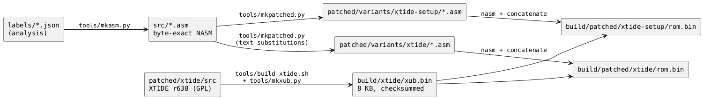
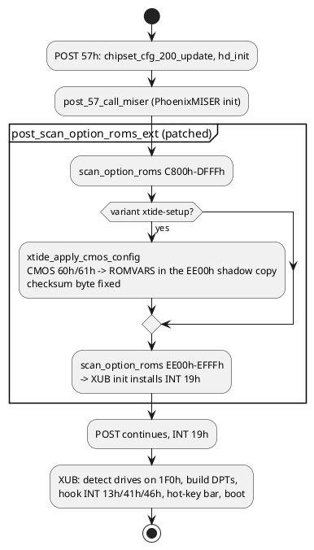
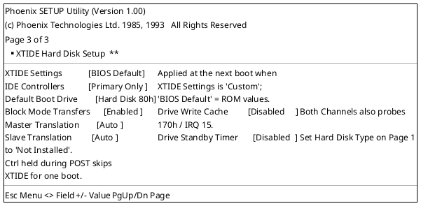

# Patched ROM variants: XTIDE Universal BIOS for LBA disks

Goal: give the 486 an INT 13h that can address the whole 4 GB CompactFlash card (and any other
IDE device up to the LBA48 range) without touching the rest of the Phoenix firmware. The route is
to **embed the XTIDE Universal BIOS (XUB) as an option ROM** in the 8 KB of padding the original
image already has at offset `0E000h` (segment `EE00h`), make POST initialise it, and, in the second
variant, give it a page in the Phoenix SETUP so its settings can be changed without a rebuild.
Everything is built from assembly: the re-assemblable Phoenix sources plus the XTIDE source tree.

Status: **built and exercised under a CPU emulator; `xtide-setup` has now booted on the machine**
(spare chip, 2026-09-09; see "First hardware test" below). CF-card drive access and the
save-to-disk/PHDISK path are still unverified on hardware.

## The variants and how to build them

All commands run from the `bios` folder in WSL (see [06](06-method-and-tools.md) for the venv and
NASM). `build/` is not committed; the images are reproducible from the repository.

| Variant | Command | Output | Contents |
|---|---|---|---|
| original | `bash tools/build.sh` | `build/rebuilt/rom.bin` | byte-exact rebuild of the factory image from `src/*.asm`; prints `IDENTICAL` |
| `xtide` | `bash tools/build_patched.sh xtide` | `build/patched/xtide/rom.bin` | XUB in the slot, extended option-ROM scan, MISER save-to-disk fix. 37 bytes changed outside the slot |
| `xtide-setup` | `bash tools/build_patched.sh xtide-setup` | `build/patched/xtide-setup/rom.bin` | everything in `xtide` plus SETUP page 3 "XTIDE Hard Disk Setup" and the POST step that applies its CMOS values to XUB. About 1.5 KB changed in the system BIOS |
| both | `bash tools/build_patched.sh` | both of the above | |
| XTIDE alone | `bash tools/build_xtide.sh` | `build/xtide/ide_386.bin`, `build/xtide/xub.bin` | the option ROM by itself (7566 bytes, then padded and checksummed to 8 KB) |

Knobs: `IDE_CONTROLLER_COUNT=2 bash tools/build_patched.sh xtide` builds XUB with both channels
enabled in ROM (the `xtide-setup` variant makes that a SETUP field instead); `SKIP_GEN=1` assembles
the `.asm` files in `patched/variants/` as they are instead of regenerating them from `src/`;
`NASM=` and `PY=` point at other tools.

Image layout of both patched variants (128 KB):

| Image offset | Segment | Content |
|---|---|---|
| `00000-07FFF` | `C000` | C&T 65535 VGA BIOS, unchanged |
| `08000-0DFFF` | `E800` | PhoenixMISER, 9 bytes changed |
| `0E000-0FFFF` | `EE00` | XTIDE Universal BIOS r638, 386 build, `-DIDE_CONTROLLER_COUNT=1`, padded to 8 KB with a valid option-ROM checksum |
| `10000-1FFFF` | `F000` | Phoenix system BIOS: 28 bytes changed (`xtide`) or about 1.5 KB (`xtide-setup`), all inside the SETUP segment and the free block `3FBC-57FF` |

## Variant `xtide`: what changes, byte for byte

| Where | Change | Bytes |
|---|---|---|
| system BIOS `post_57_option_rom_c800` (`F000:6B46`) | the `C800h-DFFFh` option-ROM scan call becomes `call post_scan_option_roms_ext` + 6 NOPs | 9 |
| system BIOS `F000:3FBC` (was FFh fill in the SETUP segment) | new stub `post_scan_option_roms_ext`: original scan, then a scan of `EE00h-EFFFh`; the rest of the gap is re-padded so nothing else moves | 19 |
| PhoenixMISER `std_disk_setup` (`E800:5654`) | the two stores that forced INT 13h back to the Phoenix driver (`F000:E3FE`) become 9 NOPs, so save-to-disk uses the live INT 13h (XTIDE) and the INT 41h geometry XTIDE installs | 9 |
| image `0E000h-0FFFFh` | the XTIDE option ROM | 7177 |

Nothing else differs from the original image (the build prints the `cmp` summary). The Phoenix
option-ROM scanner (`scan_option_roms`) checks the `55AAh` signature and the 8-bit checksum, then
far-calls the init entry at `+3`. XUB's init (`Initialize_FromMainBiosRomSearch`) only installs its
INT 19h boot-loader handler; drive detection, the INT 13h/41h/46h hooks and the boot happen when
POST issues INT 19h, after every Phoenix initialisation step. The Phoenix INT 13h remains reachable
(INT 40h for floppies, and as the previous handler XUB chains to for drives it does not own).
Holding **Ctrl** during POST makes XUB skip its installation.

### XTIDE configuration used

The r638 386 build defaults are kept except the controller count:

| Setting | Value | Why |
|---|---|---|
| Operating mode | full (1 KB stolen from base RAM for its variables) | needed for LBA/EBIOS and hot keys |
| Controllers | **1**: primary `1F0h`/`3F0h`, 16-bit ATA, IRQ 14 | the notebook has one channel; IRQ 15 belongs to PhoenixMISER, so the secondary controller (`170h`/IRQ 15) is disabled |
| Drive translation | automatic (CHS / LARGE / assisted LBA chosen from the drive size), block mode on, write cache disabled | XUB defaults |
| Modules in the build | IRQ, EBIOS (INT 13h extensions, LBA48), hot-key bar, power management, serial drive, 8-bit IDE, advanced ATA, Win9x CMOS hack | the makefile's "386" target |
| Boot | default drive `80h`, no boot menu (small build) | hot keys at boot select another drive |

To change any of this in the `xtide` variant, edit the ROMVARS defaults at the top of
`patched/xtide/src/XTIDE_Universal_BIOS/Src/Main.asm` (or add another `-D` override the way
`IDE_CONTROLLER_COUNT` is done) and rebuild. Alternatively run `XTIDECFG.COM` from the r638
release under DOS on `build/xtide/xub.bin`, save, and splice the result in with
`cat build/patched/xtide/vga.bin build/patched/xtide/miser.bin build/xtide/xub.bin build/patched/xtide/sys.bin > rom.bin`.
The `xtide-setup` variant makes the common settings a SETUP page instead.

## Variant `xtide-setup`: a third SETUP page

The Phoenix SETUP is table driven (see [05](05-setup-utility.md#implementation-notes)): each page
is an array of 32-byte field records with the generic option-list handlers, a 14-byte descriptor
with the title and label text, and a value array in the work frame. The patch adds a third entry
to the four page tables and a page of eight fields whose values live in **CMOS 60h and 61h**, two
bytes that neither the system BIOS nor PhoenixMISER use and that sit inside the Phoenix extended
checksum range (40h-7Dh), so F4 protects them like every other setting.

(Rendered by the real SETUP code under the emulator, see below; the mock-up reproduces that
screen.)

| Field | Values | CMOS | Applied to |
|---|---|---|---|
| XTIDE Settings | BIOS Default, Custom | 60h bit 0 | master switch: with `BIOS Default` POST leaves the option ROM exactly as built |
| IDE Controllers | Primary Only, Both Channels | 60h bit 1 | `ROMVARS.bIdeCnt` = 1 / 2 (`Both` also probes 170h / IRQ 15, which PhoenixMISER uses) |
| Default Boot Drive | Hard Disk 80h, Hard Disk 81h, Floppy A: | 60h bits 2-3 | `ROMVARS.bBootDrv` = 80h / 81h / 00h |
| Block Mode Transfers | Enabled, Disabled | 60h bit 4 | `FLG_DRVPARAMS_BLOCKMODE` in both drive parameter words |
| Drive Write Cache | Disabled, Drive Default, Enabled | 60h bits 5-6 | `DRVPARAMS` write-cache field (1 / 0 / 2) |
| Master Translation | Auto, CHS, LARGE, LBA | 61h bits 0-1 | `TRANSLATEMODE` field of `ideVars0.drvParamsMaster` (3 / 0 / 1 / 2) |
| Slave Translation | Auto, CHS, LARGE, LBA | 61h bits 2-3 | same for `drvParamsSlave` |
| Drive Standby Timer | Disabled, 1, 5, 10, 20 minutes | 61h bits 4-6 | `ROMVARS.bIdleTimeout` = 0 / 12 / 60 / 120 / 240 (ATA standby units of 5 s) |

All-zero CMOS (a cleared battery, or "Load default values") means `BIOS Default` for everything,
which is also what the field defaults produce, so a corrupted CMOS can never leave XTIDE in an
odd state.

### How the page is wired in (`tools/mkpatched.py`, function `patch_sys_setup_page`)

| Original code | Change |
|---|---|
| `setup_select_page` `2626/2637/2648/265B` load the page tables at `03CC/03CE/03D2/03D6` | load three-entry copies `xt_page_counts / xt_page_values / xt_page_records / xt_page_descriptors` in the free block; pages 1-2 entries are copied verbatim, page 3 uses value-array frame offset `100h` (pages 1-2 use `E5h` and `F9h`; nothing else touches `100h-107h`) |
| `setup_key_pgdn` `266D` `cmp al,1`, `setup_key_pgup` `268A` `mov al,1` | `2` (last page index) |
| `setup_draw_page_number` `2923` `mov al,1` | `2`: "Page x of 3" |
| `setup_init_pages_draw` `25F6` `mov cx,2` | `3` |
| `setup_init_page1_fields` `1F50-1F60` (17 bytes: select page 2, init its 6 fields) | `call xt_setup_init_pages_2_3` + 14 NOPs; the helper does page 2 and then page 3 (8 fields) with the same `setup_init_fields_range`, so initial load, F5 reload and the defaults pass cover the new fields |
| `setup_field_prev` `2542/2546` `cmp [bp+25],1 / je` | `cmp [bp+25],0 / jne`: the Basic-page hidden-row logic (it peeks at field 10h, the disk type) now applies only to page 1, so page 3 takes the generic path. Pages 1 and 2 behave exactly as before |
| `post_scan_option_roms_ext` | calls `xtide_apply_cmos_config` between the two scans |

`xtide_apply_cmos_config` (about 240 bytes in the free block) reads CMOS 60h/61h through
`cmos_read`; if bit 0 of 60h is clear it returns. Otherwise it checks the `55AAh` signature and
the `XUB212` ROMVARS signature at `EE00:0006`, sets chipset register 207h bit 11 (write enable for
the `EC000-EFFFF` shadow block; POST 53h shadows `E0000-EFFFF` in 16 KB blocks, register 200h
bits 8-11, and the copy is what executes), writes the five ROMVARS bytes through lookup tables,
recomputes the option-ROM checksum byte at `EE00:1FFF`, and restores register 207h. XUB reads
ROMVARS from its own segment at boot, so the shadow copy is what counts. The MISER pop-up SETUP
refreshes only the `E0000-E7FFF` and `F0000-FFFFF` shadows from ROM afterwards, so the patched
block survives a pop-up session; a save-to-disk image contains the patched copy as well.

### Verification without hardware

Two scripts in `tools/` run the real code under the Unicorn CPU emulator (`pip install unicorn`
in the venv, done by `tools/setup-wsl.sh`):

- `python tools/test_xtide_apply.py` calls `xtide_apply_cmos_config` from the built image with
  four CMOS settings and checks every ROMVARS byte, the zero checksum, that only bytes 72-90 change,
  that register 207h goes `0800h` then back, and that registers and stack are preserved. All pass.
- `python tools/emu_setup.py build/patched/xtide-setup/rom.bin space pgdn pgdn ...` runs
  `setup_main` itself with an emulated INT 10h screen, INT 16h key script, CMOS, refresh toggle and
  chipset ports, printing the screen at every key request. Used to check: "Page 3 of 3" with the
  layout above, PgDn/PgUp wrap across three pages, Up from the first row and Down from the last row
  on page 3, Right/Left/+/- cycling with wrap-around, Enter beeping, the exit menu, F6, and F4
  writing `60h`/`61h` plus the extended checksum bytes `7Eh/7Fh` (for example `Custom` + `Both
  Channels` + CHS/CHS gives `60h=03h`, `61h=05h`). Pages 1 and 2 render as in the original.

What the emulator does not cover: the chipset (register writes are recorded, not modelled), the
pop-up path inside SMM, real drives. Those need the machine.

### First hardware test (2026-09-09)

`xtide-setup`, built from a `src/` regenerated on 2026-09-06 (`r638 (2026-09-06)` banner), was flashed to
the spare chip and booted with no CF card attached (deliberately, to avoid any risk to the card's existing
Ontrack Disk Manager MBR before the BIOS was confirmed stable). Observed, matching the emulator predictions:

- VGA banner, system BIOS banner (`NBE BIOS For STN Panel.[94070501]`, CPU speed) unpatched and normal.
- The XTIDE banner (`-=XTIDE Universal BIOS (386)=- @ EE00h`) prints after the "Press Ctrl+Alt+S" line, i.e.
  the extended option-ROM scan hook fires at the right point in POST.
- `MODULE_HOTKEYS` (enabled in `tools/build_xtide.sh`'s define list) draws a persistent boot-device bar
  (`A»FDD [A]  C»HDD [C]  F6 ComDtct  F8 RomBoot`) on screen row 0 and scrolls everything printed before it
  down by one row. This is expected XUB behaviour, not a screen-writing bug — easy to mistake for one since
  the stock BIOS never reserves a row like this.
- `Master at 1F0h: not found` / `Slave at 1F0h: not found` (correct, no drive attached), then the INT 19h
  boot order fell through `Booting C»C` -> `Error 1h!` -> `Booting A»A` -> the standard Phoenix
  `press F1 to retry boot, F2 for setup utility` prompt. The full scan-hook -> XUB init -> IDE detect ->
  boot-order cascade -> graceful-failure chain works end to end.
- SETUP: with **Hard Disk Type = Not Installed** (page 1) the boot-time IDE autodetect delay disappears
  (the delay with `Auto` set and no drive present is `hd_autodetect` waiting out an IDENTIFY timeout, not a
  bug). Page cycling on the `xtide-setup` build reaches **Page 3 of 3** ("XTIDE Hard Disk Setup")
  correctly. An earlier test that appeared to have "no page 3" and PgDn "returning to page 1" turned out to
  be the **`xtide` variant** flashed instead of `xtide-setup` — `xtide` has no third page, so PgDn wrapping
  page 2 -> page 1 (`mod 2`) was correct behaviour for that build, not a defect.

Still untested on hardware: a CF card actually attached (IDE detection succeeding, LBA/CHS reads, the
third-page settings actually changing what XUB does), F4 save-and-reboot applying CMOS 60h/61h on a real
boot, and the save-to-disk/PHDISK path.

## Phoenix SETUP settings to use with either variant

- **Hard Disk Type = Not Installed** for both drives on page 1. XUB then owns `80h` (and `81h` for a
  slave) and the Phoenix driver never programs the drive. If a type is left set, the Phoenix
  driver counts the drive in `40:75` and XUB removes that count again (its "clear BDA HD count"
  flag is on), so it still works, but the CHS type in CMOS would be meaningless.
- Save-to-disk / PHDISK: the PHDISK partition must be created with the disk under XTIDE's
  geometry, and it stays subject to the CHS interface MISER uses (`lba_to_chs_int13`, INT 13h
  AH=02h/03h), i.e. within the first 8 GB. Untested; if suspend-to-disk misbehaves, disable
  Save-to-Disk in SETUP (it is off unless a PHDISK partition exists anyway).

## Known risks (why this needs a spare chip)

- The extended scan runs after PhoenixMISER's POST hook and before INT 19h, mirroring where a
  real add-in card ROM would run. The stub and the page live in the SETUP segment below the
  checksummed core (`F000:5800-FFFF`); the POST checksum result is ignored by this firmware anyway,
  and the anti-tamper copyright check covers only `E020h-E2C2h` + `E840h`, which are untouched.
- IRQ 14 handling during save-to-disk: MISER installs its own INT 76h stub (`std_int76_stub`,
  sets `40:8E` and EOIs), which matches the standard BIOS protocol XUB's IRQ module waits on;
  not verified on hardware.
- Boot order: without the boot-menu module XUB boots the default drive and the floppy through the
  hot-key bar; the SETUP page (or XTIDECFG) changes the default.
- The 386 small build has no `MODULE_VERY_LATE_INIT`; if something else ever replaced INT 19h
  after the scan, XUB would not initialise. Nothing in this POST does.
- `Both Channels` makes XUB probe 170h and claim IRQ 15, which PhoenixMISER uses; leave it on
  `Primary Only` unless a docking IDE controller really exists.

## Source layout and licensing

| Part | Source | Tool |
|---|---|---|
| VGA, MISER, system BIOS | `patched/variants/<variant>/{vga,miser,sys}.asm`, derived from the byte-exact `src/*.asm` by `tools/mkpatched.py` (asserted text substitutions; the diff against `src/` is the whole patch) | NASM |
| XTIDE Universal BIOS | `patched/xtide/src/` = XTIDE trunk r638 (`XTIDE_Universal_BIOS/`, `Assembly_Library/`), one local change documented in `patched/xtide/CHANGES.txt` | `tools/build_xtide.sh` (NASM with the makefile's "386" module set) then `tools/mkxub.py` (pad to 8 KB, checksum byte) |
| Image | `build/xtide/xub.bin` between MISER and the system BIOS | concatenation in `build_patched.sh` |

Built with NASM 2.16.03 the XTIDE part differs from the published `ide_386.bin` only in the build
date inside its version string and in 36 `reg,reg` encodings where the release's NASM chose the
other direction bit; the instructions are identical.

XTIDE Universal BIOS is GPL v2 (`patched/xtide/src/license.txt`, authors in `Copyrights.txt`);
the source is included as the licence requires, with the local change listed in
`patched/xtide/CHANGES.txt`. Distributing a combined image means distributing the XUB part under
the GPL; the Phoenix/C&T parts remain their owners' property and are only for the machine they
came from.

## Beyond these variants: relocatable rebuild, optimisation, ROM BASIC, monitor

- **Relocatable sources.** `src/*.asm` reproduce the ROM byte for byte, but immediates that are
  addresses (`mov si, 0x2CB1`, pointer tables, ROM-stack return words) are still numbers, and
  about 13 % of the instructions are `db` to preserve encodings. A relocatable build turns those
  numbers into labels, pins only the addresses other modules and the IBM convention rely on
  (`F000:0100`, `E05B`, `E2C3`, `E3FE`, `E401`, `E6F2`, `E6F5`, `E739`, `E82E`, `E987`, `EC59`,
  `EF57`, `EFC7`, `F065`, `F0A4`, `F841`, `F859`, `FA6E`, `FE6E`, `FEA5`, `FEF3`, `FF23`, `FF53`,
  `FF54`, `FFEC-FFFF`, the copyright block `E020-E2C2` + `E840`, and the MISER API table
  `E800:0000-004B`), and lets NASM choose the shortest encodings. Measured gain: about 1.3 KB from
  encodings plus about 0.5 KB from duplicate fragments; the real value is that the 18 free gaps
  collapse into two blocks of roughly 6 KB and 7 KB.
- **ROM BASIC.** IBM Cassette BASIC and GW-BASIC are 32 KB and copyrighted; nothing that size
  fits without removing PhoenixMISER. A small public-domain Tiny BASIC (2-4 KB) hooked on INT 18h
  is the only realistic option. A Wozmon-style monitor (examine/deposit memory, ports, CMOS,
  chipset registers) is the more useful 2 KB for this machine and is the planned next addition.
